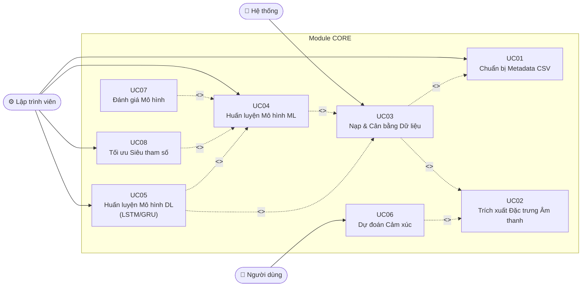
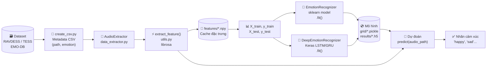
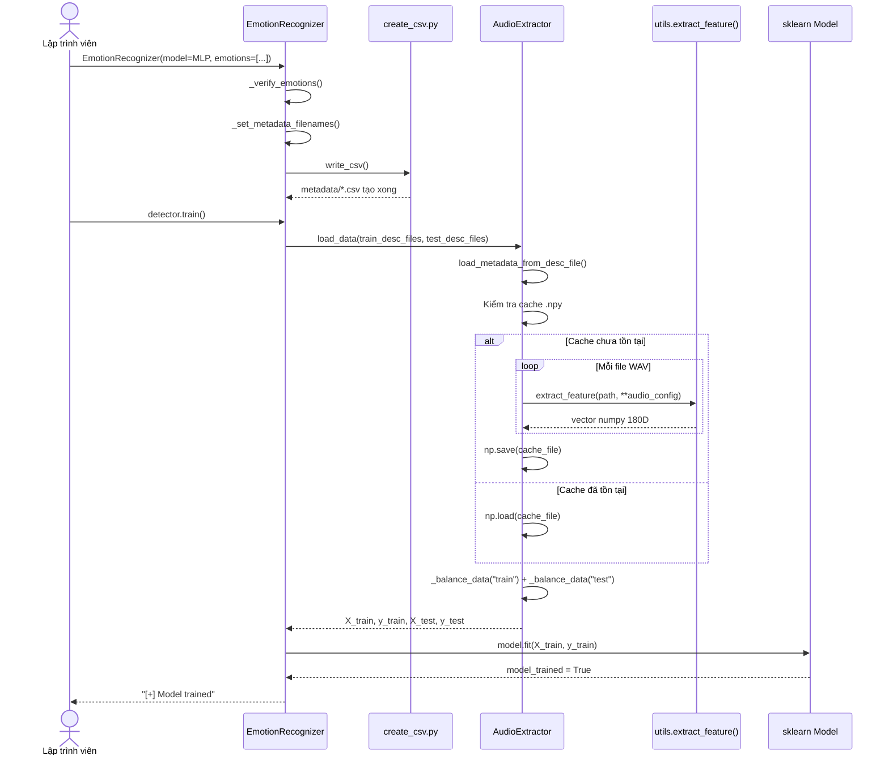
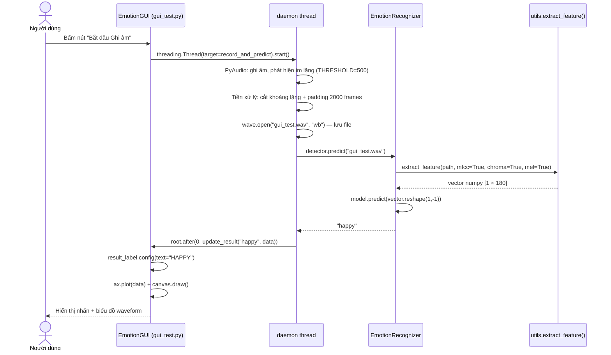
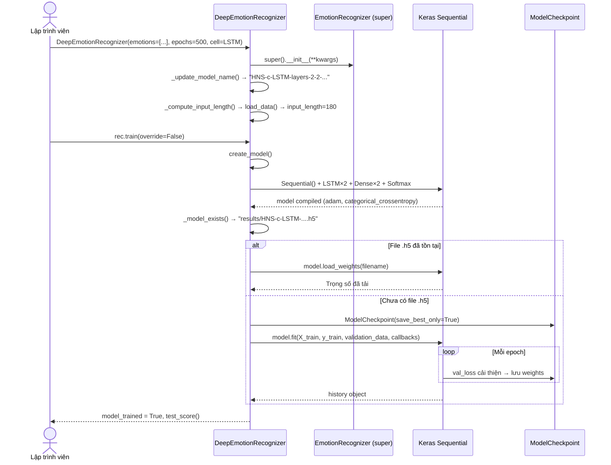

---
tags:
  - srs
  - system-design
  - core
  - machine-learning
  - deep-learning
created: 2026-03-30
updated: 2026-03-30
---
**
# TÀI LIỆU ĐẶC TẢ VÀ THIẾT KẾ MODULE: CORE (LÕI HỆ THỐNG)

> [!abstract] TỔNG QUAN
> Module Core là trái tim của hệ thống nhận dạng cảm xúc qua giọng nói, chứa toàn bộ logic nghiệp vụ cốt lõi. Module được tổ chức thành 6 thành phần: `create_csv.py` (khởi tạo metadata dữ liệu), `data_extractor.py` (trích xuất và quản lý đặc trưng), `utils.py` (hàm tiện ích và trích xuất âm thanh), `parameters.py` (không gian tham số Grid Search), `emotion_recognition.py` (lớp nhận dạng cảm xúc ML cổ điển), và `deep_emotion_recognition.py` (lớp nhận dạng cảm xúc bằng mạng nơ-ron sâu). Module hỗ trợ tối đa 9 nhãn cảm xúc, 3 bộ dataset (RAVDESS, TESS, EMO-DB), hai chế độ Phân loại (Classification) và Hồi quy (Regression).

---

## 1. ĐẶC TẢ YÊU CẦU (SOFTWARE REQUIREMENT SPECIFICATION)

### 1.1. Danh sách yêu cầu chức năng (Functional Requirements)

| ID | Tên chức năng | Module | Mức độ ưu tiên | Độ phức tạp | Tác nhân (Actor) |
|----|---------------|--------|----------------|-------------|------------------|
| CORE-01 | Tạo file metadata CSV từ dataset RAVDESS/TESS | `create_csv.py` | P1 | M | Hệ thống |
| CORE-02 | Tạo file metadata CSV từ dataset EMO-DB | `create_csv.py` | P1 | M | Hệ thống |
| CORE-03 | Tạo file metadata CSV từ dataset tùy chỉnh | `create_csv.py` | P3 | L | Lập trình viên |
| CORE-04 | Trích xuất đặc trưng MFCC từ file WAV | `utils.py` | P1 | H | Hệ thống |
| CORE-05 | Trích xuất đặc trưng Chroma, Mel, Contrast, Tonnetz | `utils.py` | P2 | H | Hệ thống |
| CORE-06 | Nạp và quản lý tập dữ liệu huấn luyện/kiểm thử | `data_extractor.py` | P1 | H | Hệ thống |
| CORE-07 | Cân bằng tập dữ liệu theo lớp (Class Balancing) | `data_extractor.py` | P2 | M | Hệ thống |
| CORE-08 | Cache đặc trưng âm thanh vào file `.npy` | `data_extractor.py` | P2 | M | Hệ thống |
| CORE-09 | Huấn luyện mô hình ML cổ điển (sklearn) | `emotion_recognition.py` | P1 | H | Lập trình viên |
| CORE-10 | Dự đoán cảm xúc từ file âm thanh (ML) | `emotion_recognition.py` | P1 | M | Người dùng |
| CORE-11 | Xác định mô hình tốt nhất từ kết quả Grid Search | `emotion_recognition.py` | P2 | H | Hệ thống |
| CORE-12 | Tính toán Confusion Matrix và F-beta Score | `emotion_recognition.py` | P2 | M | Lập trình viên |
| CORE-13 | Huấn luyện mô hình Deep Learning (LSTM/GRU) | `deep_emotion_recognition.py` | P2 | H | Lập trình viên |
| CORE-14 | Dự đoán cảm xúc bằng mạng nơ-ron sâu | `deep_emotion_recognition.py` | P2 | M | Người dùng |
| CORE-15 | Lưu và tải lại trọng số mô hình DL (`.h5`) | `deep_emotion_recognition.py` | P1 | M | Hệ thống |
| CORE-16 | Định nghĩa không gian tham số Grid Search | `parameters.py` | P2 | L | Lập trình viên |

### 1.2. Biểu đồ phân cấp chức năng (Functional Hierarchy)

```mermaid
flowchart TD
    ROOT["Module CORE\n(Lõi Hệ thống)"]

    ROOT --> A["create_csv.py\nKhởi tạo Metadata"]
    ROOT --> B["data_extractor.py\nQuản lý Dữ liệu"]
    ROOT --> C["utils.py\nTiện ích & Trích xuất"]
    ROOT --> D["parameters.py\nKhông gian Tham số"]
    ROOT --> E["emotion_recognition.py\nNhận dạng ML Cổ điển"]
    ROOT --> F["deep_emotion_recognition.py\nNhận dạng DL Sâu"]

    A --> A1["write_tess_ravdess_csv()\nRAVDESS + TESS Dataset"]
    A --> A2["write_emodb_csv()\nEMO-DB Dataset"]
    A --> A3["write_custom_csv()\nCustom Dataset"]

    B --> B1["AudioExtractor\nload_train_data()"]
    B --> B2["AudioExtractor\nload_test_data()"]
    B --> B3["_balance_data()\nCân bằng lớp"]
    B --> B4["shuffle_data()\nXáo trộn dữ liệu"]

    C --> C1["extract_feature()\nMFCC/Chroma/Mel"]
    C --> C2["get_best_estimators()\nTải pickle"]
    C --> C3["get_audio_config()\nCấu hình đặc trưng"]
    C --> C4["AVAILABLE_EMOTIONS\n9 nhãn cảm xúc"]

    D --> D1["classification_grid_parameters\n6 Classifiers"]
    D --> D2["regression_grid_parameters\n5 Regressors"]

    E --> E1["EmotionRecognizer\ntrain() / predict()"]
    E --> E2["grid_search()\nGridSearchCV"]
    E --> E3["confusion_matrix()\nĐánh giá mô hình"]
    E --> E4["determine_best_model()\nTự chọn mô hình"]

    F --> F1["DeepEmotionRecognizer\nextends EmotionRecognizer"]
    F --> F2["create_model()\nSequential LSTM/GRU"]
    F --> F3["train() với\nModelCheckpoint"]
    F --> F4["predict() + predict_proba()"]
```



---

## 2. BIỂU ĐỒ USE CASE VÀ ĐẶC TẢ (USE CASE SPECIFICATIONS)

### 2.1. Biểu đồ Use Case



### 2.2. Đặc tả Use Case: Nạp và Cân bằng Dữ liệu (UC03)

> [!info] Thông tin Use Case
> **Use Case ID:** UC-CORE-03
> **Use Case Name:** Nạp và Cân bằng Dữ liệu
> **Actor:** Hệ thống (gọi từ `EmotionRecognizer.load_data()`)
> **Trigger:** `EmotionRecognizer.train()` hoặc `EmotionRecognizer.load_data()` được gọi

> [!note] Điều kiện tiên quyết (Pre-conditions)
> 1. File CSV metadata đã tồn tại tại đường dẫn `train_desc_files` và `test_desc_files`
> 2. Thư mục `features/` có quyền đọc/ghi

> [!success] Điều kiện hậu kỳ (Post-conditions)
> 1. `self.X_train`, `self.X_test` chứa ma trận đặc trưng numpy
> 2. `self.y_train`, `self.y_test` chứa mảng nhãn cảm xúc
> 3. `self.data_loaded = True`

**Luồng xử lý chính (Normal Flow):**

| Bước | Tác nhân                         | Hành động                                                                                                            |
| ---- | -------------------------------- | -------------------------------------------------------------------------------------------------------------------- |
| 1    | `EmotionRecognizer`              | Kiểm tra `data_loaded`; nếu `True` thì bỏ qua                                                                        |
| 2    | `load_data()`                    | Khởi tạo `AudioExtractor(audio_config, emotions, balance)`                                                           |
| 3    | `AudioExtractor`                 | Gọi `load_train_data(train_desc_files)` → đọc CSV, ghép DataFrame                                                    |
| 4    | `load_metadata_from_desc_file()` | Xây dựng tên file cache: `features/{partition}_{label}_{emotions}_{n}.npy`                                           |
| 5    | `AudioExtractor`                 | Nếu cache tồn tại → `np.load(name)`; nếu không → trích xuất từng file WAV bằng `extract_feature()` → `np.save(name)` |
| 6    | `_balance_data("train")`         | Đếm số mẫu mỗi lớp; lấy `minimum = min(count)`, giữ đúng `minimum` mẫu mỗi cảm xúc                                   |
| 7    | `AudioExtractor`                 | Lặp lại bước 3-6 cho `load_test_data(test_desc_files)`                                                               |
| 8    | `load_data()`                    | Trả về dict `{X_train, X_test, y_train, y_test, train_audio_paths, test_audio_paths}`                                |

**Luồng thay thế (Alternative Flow):**

| Flow ID | Điều kiện | Xử lý |
|---------|-----------|-------|
| AF-1 | Cache `.npy` đã tồn tại | Bỏ qua trích xuất, tải trực tiếp bằng `np.load()` |
| AF-2 | Một lớp cảm xúc có 0 mẫu | `_balance_data()` đặt `self.balance = False`, tiếp tục không cân bằng |
| AF-3 | Nhiều nguồn dataset cùng bật | DataFrame được ghép bằng `pd.concat()` trước khi xử lý |

### 2.3. Đặc tả Use Case: Huấn luyện Mô hình ML (UC04)

> [!info] Thông tin Use Case
> **Use Case ID:** UC-CORE-04
> **Use Case Name:** Huấn luyện Mô hình Machine Learning
> **Actor:** Lập trình viên / GUI thread
> **Trigger:** Gọi `detector.train()` trong script hoặc `EmotionGUI.init_detector_thread()`

> [!note] Điều kiện tiên quyết (Pre-conditions)
> 1. Đối tượng `model` hợp lệ đã được truyền vào `EmotionRecognizer`
> 2. Dữ liệu khả dụng (dataset tồn tại)

> [!success] Điều kiện hậu kỳ (Post-conditions)
> 1. `self.model_trained = True`
> 2. Mô hình sẵn sàng nhận lệnh `predict()`

**Luồng xử lý chính (Normal Flow):**

| Bước | Tác nhân | Hành động |
|------|----------|-----------|
| 1 | `EmotionRecognizer.train()` | Kiểm tra `data_loaded`; nếu `False` → gọi `self.load_data()` |
| 2 | `train()` | Kiểm tra `model_trained`; nếu `True` → bỏ qua (idempotent) |
| 3 | `model` | Gọi `model.fit(X=self.X_train, y=self.y_train)` (sklearn API) |
| 4 | `train()` | Đặt `self.model_trained = True`, in log nếu `verbose=1` |

**Ngoại lệ (Exceptions):**

| Exception | Điều kiện | HTTP Status | Error Code |
|-----------|-----------|-------------|------------|
| `NotFittedError` | Gọi `predict()` trước `train()` | — | Ném `sklearn.exceptions.NotFittedError` |
| `ValueError` | Kích thước đặc trưng không khớp | — | `model.fit()` ném lỗi ngay khi fit |
| `MemoryError` | Dataset quá lớn cho RAM | — | Hệ thống crash; cần giảm số lớp hoặc đặc trưng |

### 2.4. Đặc tả Use Case: Huấn luyện Mô hình Deep Learning (UC05)

> [!info] Thông tin Use Case
> **Use Case ID:** UC-CORE-05
> **Use Case Name:** Huấn luyện Mô hình Deep Learning (LSTM/GRU)
> **Actor:** Lập trình viên
> **Trigger:** Gọi `rec.train()` trên đối tượng `DeepEmotionRecognizer`

> [!note] Điều kiện tiên quyết (Pre-conditions)
> 1. `tensorflow >= 2.21.0` đã được cài đặt
> 2. Dữ liệu đã được nạp và reshape 3D

> [!success] Điều kiện hậu kỳ (Post-conditions)
> 1. File trọng số `.h5` được lưu tại `results/{model_name}.h5`
> 2. Log TensorBoard ghi tại `logs/{model_name}/`
> 3. `self.model_trained = True`

**Luồng xử lý chính (Normal Flow):**

| Bước | Tác nhân | Hành động |
|------|----------|-----------|
| 1 | `DeepEmotionRecognizer.train()` | Kiểm tra `model_created`; nếu `False` → gọi `create_model()` |
| 2 | `create_model()` | Xây dựng `Sequential`: thêm `n_rnn_layers` × `LSTM(rnn_units, return_sequences=True)` + `Dropout` |
| 3 | `create_model()` | Thêm `n_dense_layers` × `Dense(dense_units)` + `Dropout` |
| 4 | `create_model()` | Thêm lớp output: `Dense(n_emotions, activation='softmax')` (phân loại) hoặc `Dense(1, activation='linear')` (hồi quy) |
| 5 | `model.compile()` | `loss='categorical_crossentropy'`, `metrics=['accuracy']`, `optimizer='adam'` |
| 6 | `_model_exists()` | Kiểm tra file `.h5` đã tồn tại chưa; nếu có → `load_weights()` và return |
| 7 | `model.fit()` | Huấn luyện với `callbacks=[ModelCheckpoint, TensorBoard]`, `validation_data=(X_test, y_test)` |
| 8 | `ModelCheckpoint` | Tự động lưu trọng số tốt nhất (`save_best_only=True`) |

**Luồng thay thế (Alternative Flow):**

| Flow ID | Điều kiện | Xử lý |
|---------|-----------|-------|
| AF-1 | File `.h5` đã tồn tại và `override=False` | `load_weights()` tải lại trọng số, bỏ qua huấn luyện |
| AF-2 | `override=True` | Bỏ qua kiểm tra, huấn luyện lại từ đầu |
| AF-3 | `n_rnn_layers=0` | Mạng chỉ có Dense layers, không có RNN |

### 2.5. Đặc tả Use Case: Dự đoán Cảm xúc (UC06)

> [!info] Thông tin Use Case
> **Use Case ID:** UC-CORE-06
> **Use Case Name:** Dự đoán Cảm xúc từ File Âm thanh
> **Actor:** Người dùng / GUI
> **Trigger:** Gọi `detector.predict(audio_path)`

> [!note] Điều kiện tiên quyết (Pre-conditions)
> 1. `model_trained = True`
> 2. File `.wav` tồn tại và đọc được

> [!success] Điều kiện hậu kỳ (Post-conditions)
> 1. Trả về chuỗi nhãn cảm xúc (ML) hoặc chuỗi từ `int2emotions` (DL)

**Luồng xử lý chính (Normal Flow):**

| Bước | Tác nhân | Hành động |
|------|----------|-----------|
| 1 | `EmotionRecognizer.predict(path)` | Gọi `extract_feature(path, **self.audio_config)` |
| 2 | `extract_feature()` | Trả về vector numpy 1D (mặc định 180 chiều) |
| 3 | `predict()` | `feature.reshape(1, -1)` → `self.model.predict(feature)[0]` |
| 4 | **DL**: `DeepEmotionRecognizer.predict()` | `feature.reshape((1, 1, input_length))` → `np.argmax(prediction)` → `int2emotions[idx]` |

---

## 3. THIẾT KẾ DỮ LIỆU VÀ CẤU TRÚC (DATA DESIGN)

### 3.1. Cấu trúc Vector Đặc trưng Âm thanh

| Đặc trưng | Số chiều | API librosa | Mô tả kỹ thuật |
|-----------|:--------:|-------------|----------------|
| **MFCC** | 40 | `librosa.feature.mfcc(n_mfcc=40)` | Hệ số cepstral thang Mel, đặc trưng phổ giọng nói |
| **Chroma STFT** | 12 | `librosa.feature.chroma_stft(S=stft)` | Năng lượng theo 12 bậc nốt nhạc |
| **MEL Spectrogram** | 128 | `librosa.feature.melspectrogram()` | Phổ năng lượng theo thang tần số Mel |
| **Spectral Contrast** | 7 | `librosa.feature.spectral_contrast()` | Độ tương phản phổ (tùy chọn) |
| **Tonnetz** | 6 | `librosa.feature.tonnetz()` | Quan hệ âm điệu tonal (tùy chọn) |
| **Tổng mặc định** | **180** | MFCC + Chroma + Mel | Vector đầu vào cho mô hình |

### 3.2. Cấu trúc File Metadata CSV

> [!abstract] Cấu trúc chung của tất cả file CSV

| Cột | Kiểu | Mô tả |
|-----|------|-------|
| `path` | STRING | Đường dẫn tương đối đến file `.wav` |
| `emotion` | STRING | Nhãn cảm xúc (sad, happy, angry, v.v.) |

**Quy ước đặt tên file CSV:**

| Dataset | File Train | File Test |
|---------|-----------|-----------|
| TESS & RAVDESS | `metadata/train_tess_ravdess.csv` | `metadata/test_tess_ravdess.csv` |
| EMO-DB | `metadata/train_emodb.csv` | `metadata/test_emodb.csv` |
| Custom | `metadata/train_custom.csv` | `metadata/test_custom.csv` |

### 3.3. Hằng số và Ánh xạ Dữ liệu

> [!abstract] AVAILABLE_EMOTIONS — 9 cảm xúc được hỗ trợ (`core/utils.py`)

```python
AVAILABLE_EMOTIONS = {
    "neutral", "calm", "happy", "sad",
    "angry", "fear", "disgust",
    "ps",      # pleasant surprised
    "boredom"
}
```

> [!abstract] Mã hoá cảm xúc EMO-DB (`core/create_csv.py`)

| Ký tự (vị trí 5) | Nhãn cảm xúc |
|:-----------------:|:------------:|
| `W` | angry |
| `L` | boredom |
| `E` | disgust |
| `A` | fear |
| `F` | happy |
| `T` | sad |
| `N` | neutral |

### 3.4. Cấu trúc File Cache Đặc trưng

**Quy tắc đặt tên file `.npy`:**

```
features/{partition}_{feature_label}_{first_letters}_{n_samples}.npy
```

| Thành phần | Ví dụ | Mô tả |
|-----------|-------|-------|
| `partition` | `train` / `test` | Phân vùng dữ liệu |
| `feature_label` | `mfcc-chroma-mel` | Các đặc trưng được bật, nối bằng `-` |
| `first_letters` | `HNS` | Chữ cái đầu (viết hoa) của danh sách cảm xúc, sắp xếp alphabet |
| `n_samples` | `1260` | Tổng số mẫu trong partition |

---

## 4. KIẾN TRÚC HỆ THỐNG VÀ LUỒNG XỬ LÝ (SYSTEM ARCHITECTURE)

### 4.1. Kiến trúc mã nguồn

> [!info] Mô hình Kế thừa OOP (Inheritance Architecture)
> Module Core được thiết kế theo mô hình kế thừa rõ ràng:

| Lớp (Class) | File | Kế thừa từ | Trách nhiệm |
|-------------|------|-----------|-------------|
| `AudioExtractor` | `data_extractor.py` | — | Đọc metadata, trích xuất và cache đặc trưng, cân bằng dataset |
| `EmotionRecognizer` | `emotion_recognition.py` | — | Pipeline trung tâm: khởi tạo, train, predict, đánh giá ML |
| `DeepEmotionRecognizer` | `deep_emotion_recognition.py` | `EmotionRecognizer` | Ghi đè các phương thức với logic DL, xây dựng mạng Keras |

### 4.2. Luồng dữ liệu tổng thể (End-to-End Data Flow)



### 4.3. Danh sách Lớp và Phương thức

> [!abstract] Class: `EmotionRecognizer` (`emotion_recognition.py`)

| Phương thức | Tham số | Trả về | Mô tả |
|-------------|---------|--------|-------|
| `__init__(model, **kwargs)` | model, emotions, features, tess_ravdess, emodb, ... | — | Khởi tạo, ghi CSV, chọn mô hình |
| `write_csv()` | — | — | Tạo file metadata CSV cho các dataset được bật |
| `load_data()` | — | — | Nạp và trích xuất đặc trưng, lưu vào `X_train/test, y_train/test` |
| `train(verbose)` | verbose=1 | — | Huấn luyện mô hình sklearn |
| `predict(audio_path)` | str | str | Dự đoán nhãn cảm xúc |
| `predict_proba(audio_path)` | str | dict | Xác suất mỗi lớp `{emotion: prob}` |
| `test_score()` | — | float | Accuracy (phân loại) hoặc MSE (hồi quy) trên tập test |
| `train_score()` | — | float | Accuracy hoặc MSE trên tập train |
| `grid_search(params, n_jobs)` | dict, int | tuple | `(best_estimator, best_params, best_score)` |
| `determine_best_model()` | — | — | Tải và so sánh mô hình từ `grid/*.pickle`, chọn tốt nhất |
| `confusion_matrix(percentage, labeled)` | bool, bool | DataFrame/ndarray | Ma trận nhầm lẫn |
| `get_samples_by_class()` | — | DataFrame | Số mẫu train/test theo từng lớp cảm xúc |

> [!abstract] Class: `DeepEmotionRecognizer` (`deep_emotion_recognition.py`) — Kế thừa từ `EmotionRecognizer`

| Phương thức | Tham số | Trả về | Mô tả |
|-------------|---------|--------|-------|
| `__init__(**kwargs)` | n_rnn_layers, rnn_units, n_dense_layers, dense_units, cell, dropout, epochs, batch_size, ... | — | Kế thừa + cấu hình mạng DL |
| `create_model()` | — | — | Xây dựng Sequential Keras với LSTM/GRU + Dense |
| `train(override)` | bool | — | Huấn luyện hoặc tải lại trọng số `.h5` |
| `predict(audio_path)` | str | str | Dự đoán bằng `argmax(softmax)` → tên nhãn |
| `predict_proba(audio_path)` | str | dict | Xác suất softmax mỗi lớp |
| `test_score()` | — | float | Accuracy/MAE trên tập test (overrides) |
| `_update_model_name()` | — | — | Tạo tên file model duy nhất từ tham số |
| `_model_exists()` | — | str/None | Trả về path nếu file `.h5` tồn tại |

> [!abstract] Class: `AudioExtractor` (`data_extractor.py`)

| Phương thức | Tham số | Trả về | Mô tả |
|-------------|---------|--------|-------|
| `load_train_data(desc_files, shuffle)` | list, bool | — | Nạp dữ liệu huấn luyện từ CSV |
| `load_test_data(desc_files, shuffle)` | list, bool | — | Nạp dữ liệu kiểm thử từ CSV |
| `load_metadata_from_desc_file(desc_files, partition)` | list, str | — | Đọc CSV → trích xuất/tải cache đặc trưng |
| `balance_training_data()` | — | — | Cân bằng tập train |
| `balance_testing_data()` | — | — | Cân bằng tập test |
| `shuffle_data_by_partition(partition)` | str | — | Xáo trộn dữ liệu theo phân vùng |

---

## 5. BIỂU ĐỒ TUẦN TỰ (SEQUENCE DIAGRAMS)

### 5.1. Biểu đồ tuần tự: Khởi tạo và Huấn luyện Mô hình ML



### 5.2. Biểu đồ tuần tự: Dự đoán Cảm xúc Realtime (GUI)



### 5.3. Biểu đồ tuần tự: Huấn luyện Mô hình Deep Learning



---

## 6. CÁC QUY TẮC NGHIỆP VỤ (BUSINESS RULES)

### 6.1. Quy tắc xác thực dữ liệu

| Trường | Quy tắc | Điều kiện/Giá trị |
|--------|---------|-------------------|
| `emotions` | Phải thuộc `AVAILABLE_EMOTIONS` | Kiểm tra bởi `_verify_emotions()` |
| `features` | Chấp nhận các giá trị: `mfcc`, `chroma`, `mel`, `contrast`, `tonnetz` | Kiểm tra bởi `get_audio_config()` |
| `train_size` (EMO-DB) | Tỉ lệ chia train | Mặc định `0.8` (80/20) |
| `n_rnn_layers` + `n_dense_layers` | Tổng số lớp = số phần tử trong list `dropout` | Bắt buộc khớp để tránh IndexError |
| File âm thanh | Định dạng WAV hợp lệ | Kiểm tra bởi `soundfile.SoundFile`; fallback sang `ffmpeg` |

### 6.2. Quy tắc kiến trúc mạng Deep Learning

| Tham số | Giá trị mặc định | Mô tả |
|---------|:----------------:|-------|
| `n_rnn_layers` | 2 | Số lớp RNN (LSTM/GRU) |
| `n_dense_layers` | 2 | Số lớp Dense |
| `rnn_units` | 128 | Số units mỗi lớp RNN |
| `dense_units` | 128 | Số units mỗi lớp Dense |
| `dropout` | 0.3 | Tỉ lệ Dropout cho tất cả các lớp |
| `cell` | `LSTM` | Kiểu ô RNN (`LSTM` hoặc `GRU`) |
| `epochs` | 500 | Số epoch huấn luyện |
| `batch_size` | 64 | Kích thước batch |
| `optimizer` | `adam` | Thuật toán tối ưu |
| `loss` | `categorical_crossentropy` | Hàm mất mát (phân loại) |

### 6.3. Quy tắc lựa chọn mô hình tự động

> [!important] Logic `determine_best_model()` trong `EmotionRecognizer`

1. Tải tất cả estimator từ `grid/best_classifiers.pickle` (kết quả của `tools/grid_search.py`)
2. Train từng estimator trên `X_train` đã nạp sẵn
3. So sánh `test_score()` của từng estimator
4. Chọn estimator có **accuracy cao nhất** (phân loại) hoặc **MAE thấp nhất** (hồi quy)
5. Nếu `grid/` không có file pickle hợp lệ → dùng `BaggingClassifier()` làm mặc định

### 6.4. Quy tắc tạo tên Model DL (Naming Convention)

```
{emotions_str}-{problem_type}-{cell}-layers-{n_rnn}-{n_dense}-units-{rnn_units}-{dense_units}-dropout-{dropout_str}.h5
```

**Ví dụ:** `HNS-c-LSTM-layers-2-2-units-128-128-dropout-0.3_0.3_0.3_0.3.h5`

| Thành phần | Ý nghĩa |
|-----------|---------|
| `HNS` | Happy + Neutral + Sad (chữ cái đầu, sort alpha) |
| `c` | Classification (`r` cho Regression) |
| `LSTM` | Kiểu cell RNN |
| `layers-2-2` | 2 RNN layers + 2 Dense layers |
| `units-128-128` | rnn_units=128, dense_units=128 |
| `dropout-0.3_0.3_0.3_0.3` | Dropout rate mỗi lớp |

---

## 7. PHỤ LỤC: KHÔNG GIAN THAM SỐ GRID SEARCH (`parameters.py`)

### 7.1. Classifier Grid Parameters

| Thuật toán | Tham số tìm kiếm |
|-----------|------------------|
| **SVC** | `C`: [0.0005→10], `gamma`: [0.001→1], `kernel`: [rbf, poly, sigmoid] |
| **RandomForestClassifier** | `n_estimators`: [10,40,70,100], `max_depth`: [3,5,7], `max_features`: [0.2,0.5,1,2] |
| **GradientBoostingClassifier** | `learning_rate`: [0.05,0.1,0.3], `n_estimators`: [40,70,100], `subsample`: [0.3→1] |
| **KNeighborsClassifier** | `weights`: [uniform, distance], `p`: [1→5], `n_neighbors`: [len(emotions)] |
| **MLPClassifier** | `hidden_layer_sizes`: [(200,),(300,),(400,),(128,128),(256,256)], `alpha`: [0.001→0.01] |
| **BaggingClassifier** | `n_estimators`: [10,30,50,60], `max_samples`: [0.1→1.0], `max_features`: [0.2→2] |

### 7.2. Regressor Grid Parameters

| Thuật toán | Tham số tìm kiếm |
|-----------|------------------|
| **RandomForestRegressor** | Tương tự Classifier cùng tên |
| **GradientBoostingRegressor** | Tương tự Classifier cùng tên |
| **KNeighborsRegressor** | `weights`, `p`, `n_neighbors` |
| **MLPRegressor** | `hidden_layer_sizes`: [(200,),(200,200),(300,),(400,)], `max_iter`: [300→700] |
| **BaggingRegressor** | `n_estimators`, `max_samples`, `max_features` |
