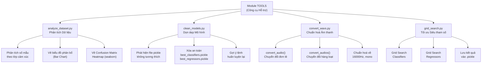
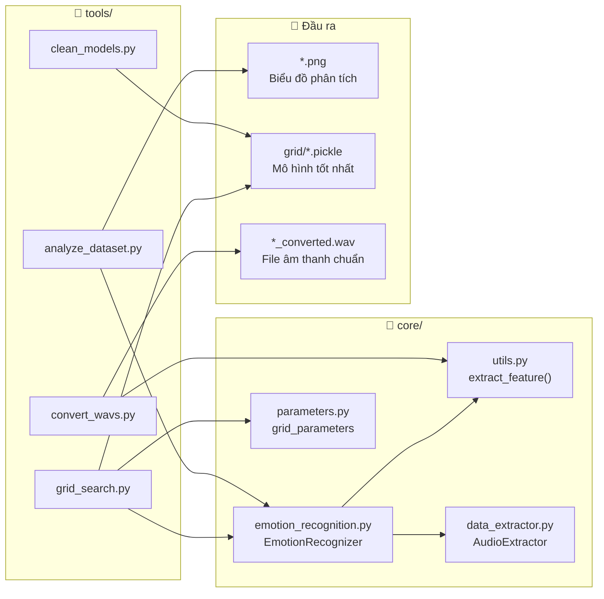

---
tags:
  - srs
  - system-design
  - tools
  - utilities
created: 2026-03-30
updated: 2026-03-30
---

# TÀI LIỆU ĐẶC TẢ VÀ THIẾT KẾ MODULE: TOOLS (CÔNG CỤ HỖ TRỢ)

> [!abstract] TỔNG QUAN
> Module Tools tập hợp các script tiện ích hỗ trợ trong quá trình phát triển, vận hành và bảo trì hệ thống nhận dạng cảm xúc qua giọng nói. Module gồm 4 thành phần chính: `analyze_dataset.py` (phân tích và trực quan hoá tập dữ liệu), `clean_models.py` (dọn dẹp mô hình cũ không tương thích), `convert_wavs.py` (chuẩn hoá định dạng file âm thanh), và `grid_search.py` (tối ưu hoá siêu tham số mô hình). Các script này không thuộc luồng chính của ứng dụng mà phục vụ mục đích phát triển và vận hành hệ thống.

---

## 1. ĐẶC TẢ YÊU CẦU (SOFTWARE REQUIREMENT SPECIFICATION)

### 1.1. Danh sách yêu cầu chức năng (Functional Requirements)

| ID | Tên chức năng | Script | Mức độ ưu tiên | Tác nhân (Actor) |
|----|---------------|--------|----------------|------------------|
| TOOLS-01 | Phân tích phân bổ dữ liệu theo lớp cảm xúc | `analyze_dataset.py` | P2 | Lập trình viên |
| TOOLS-02 | Vẽ biểu đồ Confusion Matrix heatmap | `analyze_dataset.py` | P2 | Lập trình viên |
| TOOLS-03 | Dọn dẹp file mô hình pickle không tương thích | `clean_models.py` | P1 | Lập trình viên |
| TOOLS-04 | Chuyển đổi file âm thanh đơn lẻ sang chuẩn WAV 16kHz mono | `convert_wavs.py` | P1 | Hệ thống / Lập trình viên |
| TOOLS-05 | Chuyển đổi hàng loạt file âm thanh trong thư mục | `convert_wavs.py` | P2 | Lập trình viên |
| TOOLS-06 | Tìm kiếm siêu tham số tối ưu cho classifier (GridSearchCV) | `grid_search.py` | P2 | Lập trình viên |
| TOOLS-07 | Tìm kiếm siêu tham số tối ưu cho regressor (GridSearchCV) | `grid_search.py` | P3 | Lập trình viên |
| TOOLS-08 | Lưu kết quả tối ưu vào file pickle để tái sử dụng | `grid_search.py` | P1 | Hệ thống |

### 1.2. Biểu đồ phân cấp chức năng (Functional Hierarchy)



---

## 2. ĐẶC TẢ CHI TIẾT TỪNG SCRIPT

### 2.1. Script: `analyze_dataset.py` — Phân tích và Trực quan hoá Tập dữ liệu

> [!info] Thông tin Script
> **Script ID:** TOOLS-ANALYZE
> **Tên:** Phân tích và Trực quan hoá Tập dữ liệu
> **Actor:** Lập trình viên
> **Trigger:** Chạy trực tiếp `python tools/analyze_dataset.py`

> [!note] Điều kiện tiên quyết (Pre-conditions)
> 1. Dataset (RAVDESS, TESS, EMO-DB) đã được tải về và đặt đúng cấu trúc thư mục
> 2. Thư viện `matplotlib`, `pandas`, `numpy`, `seaborn` đã được cài đặt
> 3. Module `core.emotion_recognition.EmotionRecognizer` khả dụng

> [!success] Điều kiện hậu kỳ (Post-conditions)
> 1. File ảnh `dataset_distribution.png` được lưu tại thư mục gốc dự án
> 2. File ảnh `confusion_matrix_heatmap.png` được lưu tại thư mục gốc (nếu train thành công)
> 3. Thống kê mất cân bằng lớp được in ra console

**Luồng xử lý chính (Normal Flow):**

| Bước | Đối tượng | Hành động |
|------|-----------|-----------|
| 1 | Script | Khởi tạo `EmotionRecognizer` với 8 lớp cảm xúc đầy đủ: `["sad", "neutral", "happy", "angry", "fear", "disgust", "ps", "boredom"]` |
| 2 | `EmotionRecognizer` | Gọi `get_samples_by_class()` → trả về DataFrame với cột `train`, `test`, `total` |
| 3 | Script | Loại bỏ hàng `total` cuối cùng (`df.iloc[:-1]`) để chuẩn bị vẽ biểu đồ |
| 4 | `matplotlib` | Vẽ biểu đồ cột đôi (grouped bar chart) phân bổ train/test theo từng cảm xúc |
| 5 | Script | In thống kê: lớp nhiều nhất và lớp ít nhất (`idxmax`, `idxmin`) |
| 6 | Script | Lưu biểu đồ → `plt.savefig("dataset_distribution.png")` |
| 7 | `EmotionRecognizer` | Gọi `rec.train()` để huấn luyện mô hình mặc định |
| 8 | `rec.confusion_matrix()` | Tính ma trận nhầm lẫn dạng phần trăm, trả về DataFrame có nhãn |
| 9 | `seaborn.heatmap` | Vẽ heatmap Confusion Matrix với annotation và colormap "Blues" |
| 10 | Script | Lưu heatmap → `plt.savefig("confusion_matrix_heatmap.png")` và hiển thị tất cả bằng `plt.show()` |

**Luồng thay thế (Alternative Flow):**

| Flow ID | Điều kiện | Xử lý |
|---------|-----------|-------|
| AF-1 | `seaborn` chưa được cài đặt | Bước 9 ném `ImportError`, khối `try/except` bắt lỗi, in thông báo và bỏ qua bước vẽ Confusion Matrix |
| AF-2 | Huấn luyện mô hình thất bại | Khối `except Exception as e` bắt lỗi, in `[!] Không thể vẽ Confusion Matrix thực tế`, tiếp tục `plt.show()` biểu đồ phân bổ |

**Ngoại lệ (Exceptions):**

| Exception | Điều kiện | Hành động |
|-----------|-----------|-----------|
| `FileNotFoundError` | Thư mục dataset không tồn tại | `EmotionRecognizer` tạo CSV rỗng; `get_samples_by_class()` trả về 0 mẫu |
| `PermissionError` | Không có quyền ghi file PNG | `plt.savefig()` ném lỗi; thông báo in ra console |
| `ImportError` | Thiếu `seaborn` | Bỏ qua bước vẽ heatmap, ghi log cảnh báo |

**Ví dụ đầu ra console:**

```
[*] Đang phân tích tập dữ liệu...
[!] Nhận xét: Lớp nhiều nhất (happy: 192) so với lớp ít nhất (boredom: 81)
[+] Đã lưu biểu đồ phân bổ tại: dataset_distribution.png
[*] Đang tạo Ma trận nhầm lẫn (Confusion Matrix)...
[+] Đã lưu Confusion Matrix Heatmap tại: confusion_matrix_heatmap.png
```

---

### 2.2. Script: `clean_models.py` — Dọn dẹp Mô hình Cũ

> [!info] Thông tin Script
> **Script ID:** TOOLS-CLEAN
> **Tên:** Dọn dẹp file mô hình pickle không tương thích
> **Actor:** Lập trình viên
> **Trigger:** Chạy `python tools/clean_models.py` khi gặp lỗi tải mô hình sau khi nâng cấp `scikit-learn`

> [!note] Điều kiện tiên quyết (Pre-conditions)
> 1. Thư mục `grid/` tồn tại trong thư mục gốc dự án
> 2. Có quyền đọc và xóa file trong thư mục `grid/`

> [!success] Điều kiện hậu kỳ (Post-conditions)
> 1. Các file `grid/best_classifiers.pickle` và `grid/best_regressors.pickle` đã được xóa (nếu tồn tại)
> 2. Console hiển thị số lượng file đã xóa và gợi ý lệnh huấn luyện lại

**Luồng xử lý chính (Normal Flow):**

| Bước | Đối tượng | Hành động |
|------|-----------|-----------|
| 1 | Script | Định nghĩa `grid_dir = "grid"` và danh sách `files_to_remove = ["best_classifiers.pickle", "best_regressors.pickle"]` |
| 2 | Script | Kiểm tra `os.path.exists(grid_dir)` |
| 3 | Script | Duyệt qua từng tên file trong `files_to_remove` |
| 4 | `os.path.exists()` | Kiểm tra file có tồn tại không |
| 5 | `os.remove()` | Xóa file và tăng `deleted_count` |
| 6 | Script | In log `[x] Đã xóa: {file_path}` cho mỗi file thành công |
| 7 | Script | Sau khi duyệt xong: nếu `deleted_count == 0` → in cảnh báo; ngược lại → in gợi ý chạy `python grid_search.py` |

**Luồng thay thế (Alternative Flow):**

| Flow ID | Điều kiện | Xử lý |
|---------|-----------|-------|
| AF-1 | Thư mục `grid/` không tồn tại | `os.path.exists(grid_dir)` trả về `False`, vòng lặp bị bỏ qua, `deleted_count = 0`, in thông báo không tìm thấy |
| AF-2 | Cả hai file đều không tồn tại | Vòng lặp chạy nhưng không xóa gì, `deleted_count = 0` |

**Ngoại lệ (Exceptions):**

| Exception | Điều kiện | Hành động |
|-----------|-----------|-----------|
| `PermissionError` / `OSError` | Không đủ quyền xóa file | Khối `except Exception as e` bắt lỗi, in `[!] Lỗi khi xóa {file_path}: {e}`, tiếp tục xử lý file kế tiếp |

**Ví dụ đầu ra console:**

```
--- Dọn dẹp các mô hình cũ không tương thích ---
[x] Đã xóa: grid/best_classifiers.pickle
[x] Đã xóa: grid/best_regressors.pickle
[+] Đã dọn dẹp 2 file.

[GỢI Ý] Bây giờ bạn hãy chạy lệnh sau để huấn luyện lại mô hình tương thích:
python grid_search.py
```

---

### 2.3. Script: `convert_wavs.py` — Chuẩn hoá Định dạng File Âm thanh

> [!info] Thông tin Script
> **Script ID:** TOOLS-CONVERT
> **Tên:** Chuẩn hoá file âm thanh về định dạng WAV 16kHz mono
> **Actor:** Hệ thống (gọi tự động từ `core/utils.py`) / Lập trình viên (chạy CLI)
> **Trigger:** (1) Tự động: khi `soundfile` không đọc được file WAV gốc trong `extract_feature()`. (2) Thủ công: `python tools/convert_wavs.py <audio_path> <target_path>`

> [!note] Điều kiện tiên quyết (Pre-conditions)
> 1. `ffmpeg` đã được cài đặt và thêm vào biến môi trường `PATH`
> 2. File đầu vào tồn tại và là file âm thanh hợp lệ (WAV, MP3, v.v.)
> 3. Thư mục đích có quyền ghi

> [!success] Điều kiện hậu kỳ (Post-conditions)
> 1. File WAV mới được tạo tại `target_path` với: sample rate = 16000 Hz, channels = 1 (mono)
> 2. File gốc được giữ lại (trừ khi `remove=True`)

**Hàm cốt lõi: `convert_audio(audio_path, target_path, remove=False)`**

| Bước | Đối tượng | Hành động |
|------|-----------|-----------|
| 1 | Hàm | Thực thi lệnh hệ thống: `os.system(f"ffmpeg -i {audio_path} -ac 1 -ar 16000 {target_path}")` |
| 2 | `ffmpeg` | Đọc file nguồn, chuyển đổi sang 1 kênh âm thanh (`-ac 1`) và 16000 Hz (`-ar 16000`) |
| 3 | `os.system` | Trả về mã thoát `v` (0 = thành công, khác 0 = lỗi) |
| 4 | Hàm | Nếu `remove=True`: gọi `os.remove(audio_path)` để xóa file gốc |
| 5 | Hàm | Trả về mã thoát `v` để caller kiểm tra thành công/thất bại |

**Hàm `convert_audios(path, target_path, remove=False)` — Xử lý hàng loạt:**

| Bước | Đối tượng | Hành động |
|------|-----------|-----------|
| 1 | Hàm | Duyệt đệ quy `os.walk(path)`, tạo lại cấu trúc thư mục tương ứng trong `target_path` |
| 2 | Hàm | Duyệt lại toàn bộ file trong `path`, lọc chỉ file `.wav` |
| 3 | Hàm | Gọi `convert_audio(file, target_file, remove=remove)` cho từng file |

**Giao diện dòng lệnh (CLI):**

```bash
# Chuyển đổi đơn lẻ
python tools/convert_wavs.py data/emodb/wav/03a01Fa.wav data/emodb/wav/03a01Fa_converted.wav

# Chuyển đổi cả thư mục
python tools/convert_wavs.py data/raw/ data/converted/ -r True
```

**Ngoại lệ (Exceptions):**

| Exception | Điều kiện | Hành động |
|-----------|-----------|-----------|
| `TypeError` | `audio_path` không phải thư mục hợp lệ hoặc file `.wav` | Ném `TypeError("The audio_path file you specified isn't appropriate for this operation")` |
| Lỗi ffmpeg (`v != 0`) | ffmpeg không được cài đặt hoặc định dạng không hỗ trợ | `core/utils.py` ném `NotImplementedError` khi `v` khác 0 |
| `FileNotFoundError` | File nguồn không tồn tại | `os.system` trả lỗi ffmpeg (exit code ≠ 0) |

---

### 2.4. Script: `grid_search.py` — Tối ưu hoá Siêu tham số (Grid Search)

> [!info] Thông tin Script
> **Script ID:** TOOLS-GRIDSEARCH
> **Tên:** Tìm kiếm siêu tham số tối ưu cho mô hình ML bằng GridSearchCV
> **Actor:** Lập trình viên
> **Trigger:** Chạy `python tools/grid_search.py` (thường mất nhiều giờ)

> [!note] Điều kiện tiên quyết (Pre-conditions)
> 1. Dataset đã được chuẩn bị (thư mục `data/` hợp lệ, CSV metadata có thể tạo)
> 2. Module `core.parameters` chứa `classification_grid_parameters` và `regression_grid_parameters`
> 3. Thư mục `grid/` tồn tại và có quyền ghi
> 4. `scikit-learn` đã được cài đặt

> [!success] Điều kiện hậu kỳ (Post-conditions)
> 1. File `grid/best_classifiers.pickle` được tạo hoặc ghi đè, chứa danh sách `(estimator, params, cv_score)` của các classifier tốt nhất
> 2. File `grid/best_regressors.pickle` được tạo hoặc ghi đè, chứa danh sách tương tự cho regressor
> 3. Console in điểm Cross-Validation tốt nhất cho mỗi thuật toán

**Luồng xử lý chính (Normal Flow):**

| Bước | Đối tượng | Hành động |
|------|-----------|-----------|
| 1 | Script | Định nghĩa `emotions = ['sad', 'neutral', 'happy']`, `n_jobs = 4` |
| 2 | Script | Duyệt qua `classification_grid_parameters` (dict: `{model: params}`) |
| 3 | Script | Nếu model là `KNeighborsClassifier`: gán `params['n_neighbors'] = [len(emotions)]` |
| 4 | `EmotionRecognizer` | Khởi tạo với model và danh sách cảm xúc, gọi `d.load_data()` để tải và trích xuất đặc trưng |
| 5 | `d.grid_search()` | Khởi động `GridSearchCV(model, params, cv=3, n_jobs=4)`, fit trên toàn bộ `X_train` |
| 6 | `GridSearchCV` | Thực hiện Cross-Validation 3-fold, tìm tổ hợp tham số có điểm cao nhất |
| 7 | Script | Lưu `(best_estimator, best_params, cv_best_score)` vào `best_estimators` list |
| 8 | Script | In kết quả: `{emotions} {ModelName} achieved {score:.3f} cross validation accuracy score!` |
| 9 | `pickle.dump` | Ghi `best_estimators` vào `grid/best_classifiers.pickle` |
| 10 | Script | Lặp lại Bước 2–9 cho `regression_grid_parameters` với `classification=False`, lưu vào `grid/best_regressors.pickle` |

**Tham số Grid Search (theo kết quả comment trong code):**

| Thuật toán | Tham số tốt nhất | CV Score |
|------------|------------------|---------|
| **SVC** | `C=0.001, gamma=0.001, kernel='poly'` | — |
| **AdaBoostClassifier** | `algorithm='SAMME', learning_rate=0.8, n_estimators=60` | — |
| **RandomForestClassifier** | `max_depth=7, max_features=0.5, n_estimators=40` | — |
| **GradientBoostingClassifier** | `learning_rate=0.3, max_depth=7, n_estimators=70, subsample=0.7` | — |
| **DecisionTreeClassifier** | `criterion='entropy', max_depth=7` | — |
| **KNeighborsClassifier** | `n_neighbors=5, p=1, weights='distance'` | — |
| **MLPClassifier** | `alpha=0.005, batch_size=256, hidden_layer_sizes=(300,), max_iter=500` | — |

**Ngoại lệ (Exceptions):**

| Exception | Điều kiện | Hành động |
|-----------|-----------|-----------|
| `FileNotFoundError` | Thư mục `grid/` không tồn tại | `pickle.dump` → `open()` ném lỗi; cần tạo thư mục trước |
| `MemoryError` | Dataset quá lớn với `n_jobs=4` | Giảm `n_jobs` hoặc giảm kích thước tham số grid |
| `KeyboardInterrupt` | Người dùng dừng giữa chừng | Kết quả chưa hoàn chỉnh không được lưu |

---

## 3. KIẾN TRÚC VÀ MỐI QUAN HỆ GIỮA CÁC SCRIPT

### 3.1. Sơ đồ phụ thuộc giữa các module



### 3.2. Thứ tự chạy được khuyến nghị (Workflow)


---

## 4. CÁC QUY TẮC VÀ LƯU Ý VẬN HÀNH

### 4.1. Quy tắc vận hành

| Quy tắc | Mô tả |
|---------|-------|
| **QT-01** | Luôn chạy `clean_models.py` trước khi nâng cấp `scikit-learn` lên phiên bản mới để tránh lỗi `ModuleNotFoundError` khi tải file pickle. |
| **QT-02** | Script `grid_search.py` có thể mất từ 30 phút đến vài giờ tuỳ kích thước tham số trong `parameters.py`. Khuyến nghị chạy khi máy nhàn rỗi. |
| **QT-03** | Script `convert_wavs.py` yêu cầu `ffmpeg` được cài đặt và thêm vào `PATH`. Kiểm tra bằng lệnh `ffmpeg -version`. |
| **QT-04** | Kết quả của `grid_search.py` được sử dụng tự động bởi `EmotionRecognizer.determine_best_model()`. Không xóa `grid/*.pickle` khi đang dùng ứng dụng chính. |
| **QT-05** | File PNG đầu ra của `analyze_dataset.py` được lưu tại thư mục **gốc dự án** (không phải `tools/`). Đảm bảo chạy script từ thư mục gốc. |

### 4.2. Thống kê tham số kỹ thuật

| Thông số | Giá trị | Ghi chú |
|----------|---------|---------|
| Sample rate chuẩn hoá | 16000 Hz | Tiêu chuẩn cho nhận dạng giọng nói |
| Số kênh âm thanh | 1 (mono) | Loại bỏ kênh stereo |
| Cross-Validation folds | 3 | Trong `grid_search.py` |
| Số luồng Grid Search | 4 (`n_jobs=4`) | Có thể điều chỉnh tuỳ CPU |
| Emotion classes (Grid Search) | `['sad', 'neutral', 'happy']` | Có thể mở rộng lên tối đa 9 lớp |
| Định dạng lưu mô hình | `.pickle` (Binary) | Python `pickle` protocol mặc định |
