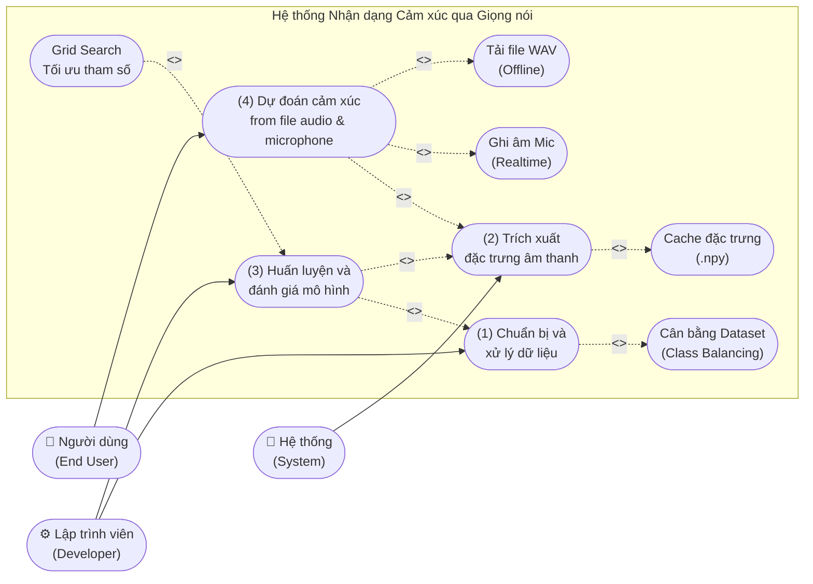
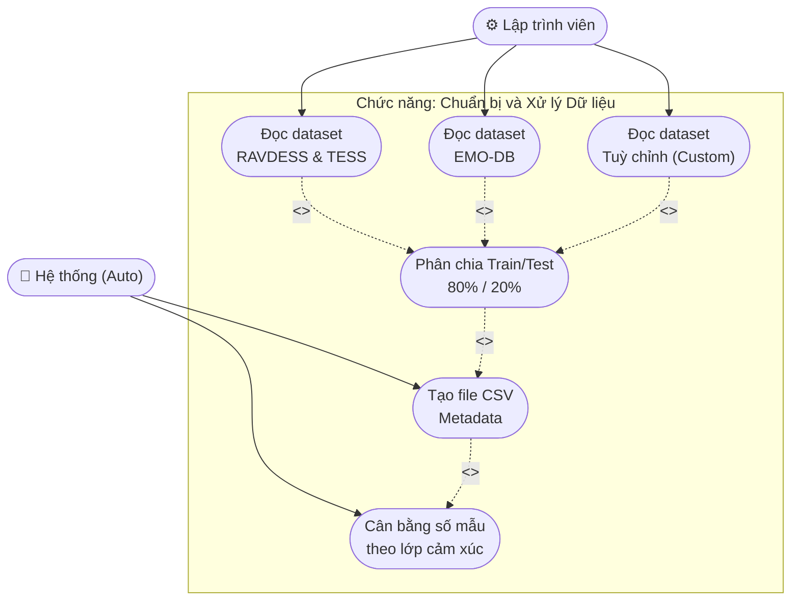
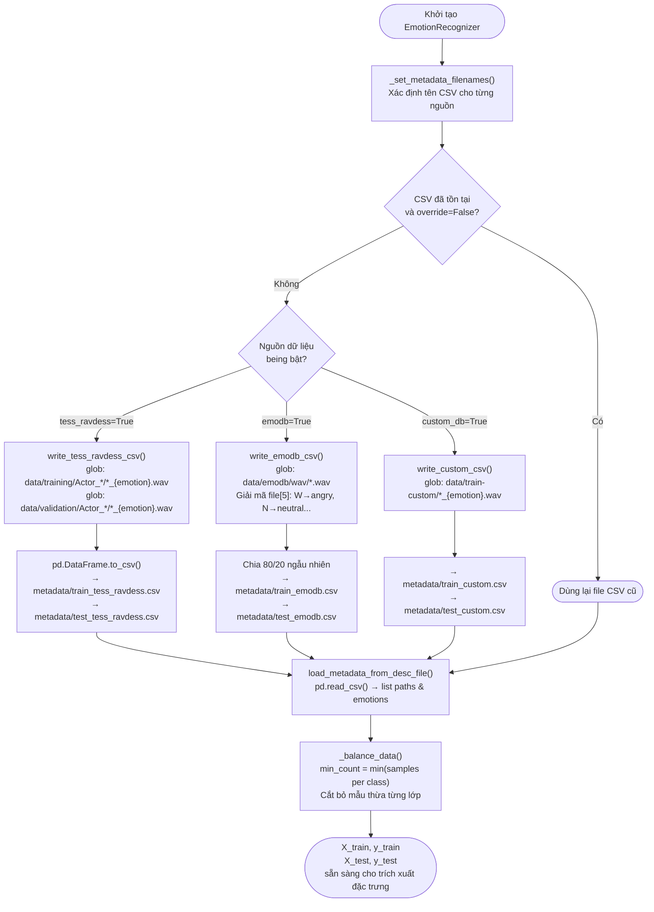
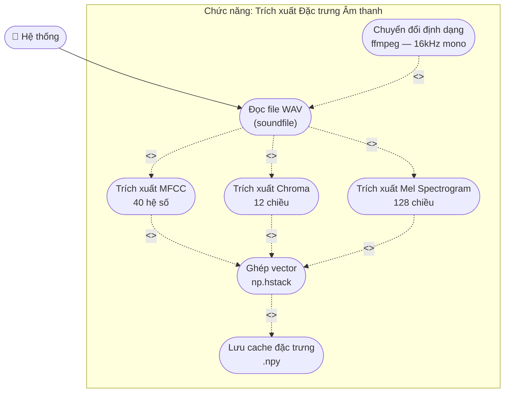
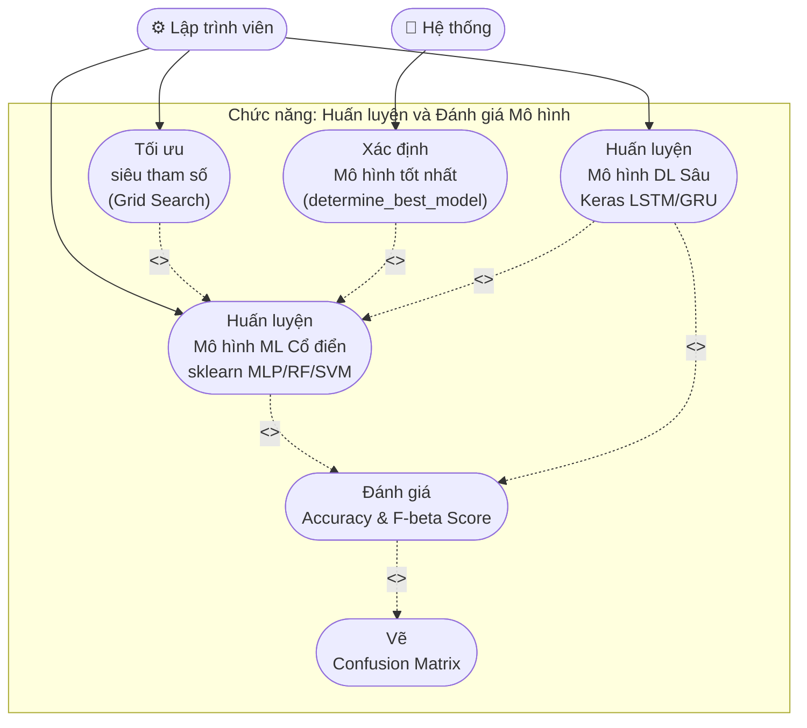
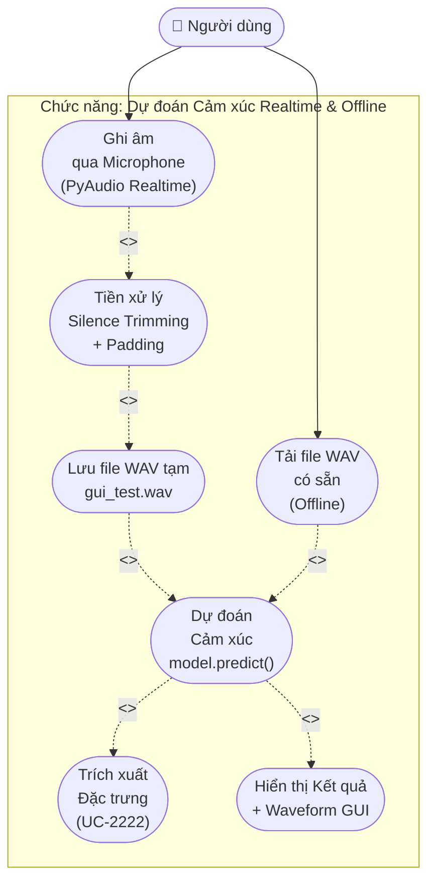
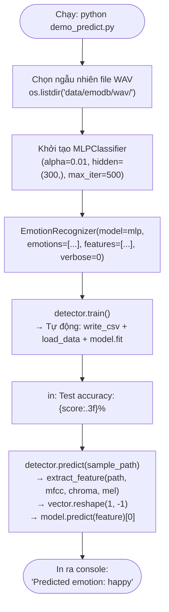
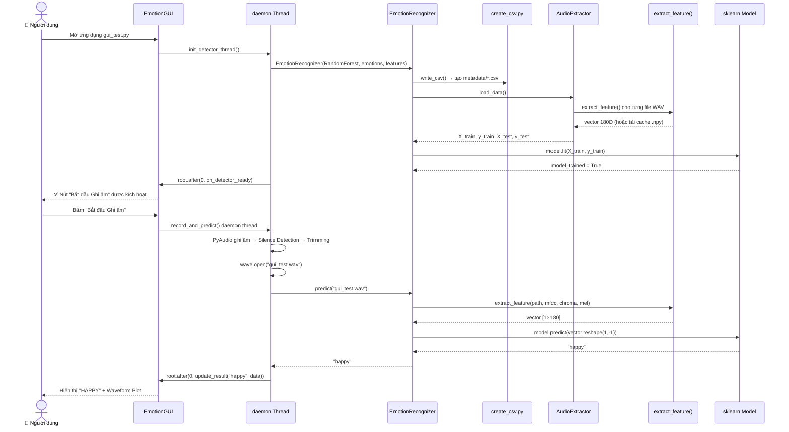

---
tags:
  - srs
  - use-case
  - system-design
  - emotion-recognition
created: 2026-03-30
updated: 2026-03-30
---

# TÀI LIỆU ĐẶC TẢ CHỨC NĂNG: CÁC CHỨC NĂNG CHÍNH HỆ THỐNG

> [!abstract] TỔNG QUAN
> Tài liệu này trình bày chi tiết đặc tả các chức năng cốt lõi của hệ thống Nhận dạng Cảm xúc qua Giọng nói (Emotion Recognition Using Speech), bao gồm sơ đồ Use Case và luồng xử lý cho 4 chức năng chính: Chuẩn bị và xử lý dữ liệu, Trích xuất đặc trưng âm thanh, Huấn luyện và đánh giá mô hình, Dự đoán cảm xúc từ file audio và microphone thời gian thực.

---

## 1. SƠ ĐỒ USE CASE TỔNG QUAN

### 1.1. Biểu đồ Use Case Tổng quan Hệ thống



### 1.2. Biểu đồ phân cấp chức năng (Functional Hierarchy)

```mermaid
flowchart TD
    ROOT["🎙️ Hệ thống Nhận dạng Cảm xúc\nEmotion Recognition Using Speech"]

    ROOT --> F1["2.2.2.1\nChuẩn bị & Xử lý Dữ liệu"]
    ROOT --> F2["2.2.2.2\nTrích xuất Đặc trưng Âm thanh"]
    ROOT --> F3["2.2.2.3\nHuấn luyện & Đánh giá Mô hình"]
    ROOT --> F4["2.2.2.4\nDự đoán Cảm xúc\nFile Audio & Microphone Realtime"]

    F1 --> F1a["Đọc dataset RAVDESS/TESS\nwrite_tess_ravdess_csv()"]
    F1 --> F1b["Đọc dataset EMO-DB\nwrite_emodb_csv()"]
    F1 --> F1c["Đọc dataset tuỳ chỉnh\nwrite_custom_csv()"]
    F1 --> F1d["Cân bằng lớp\n_balance_data()"]
    F1 --> F1e["Tạo file CSV Metadata\ntrain/test split 80/20"]

    F2 --> F2a["Trích xuất MFCC\n40 hệ số"]
    F2 --> F2b["Trích xuất Chroma\n12 chiều"]
    F2 --> F2c["Trích xuất Mel Spectrogram\n128 chiều"]
    F2 --> F2d["Ghép vector đặc trưng\nnp.hstack → 180D"]
    F2 --> F2e["Lưu / Tải cache .npy\nfeatures/"]

    F3 --> F3a["Huấn luyện ML Cổ điển\nsklearn MLP/RF/SVM..."]
    F3 --> F3b["Huấn luyện DL Sâu\nKeras LSTM/GRU"]
    F3 --> F3c["Đánh giá Accuracy\ntest_score()"]
    F3 --> F3d["Vẽ Confusion Matrix\nmatplotlib/seaborn"]
    F3 --> F3e["Tối ưu Grid Search\nGridSearchCV CV=3"]

    F4 --> F4a["Ghi âm Realtime\nPyAudio 16kHz"]
    F4 --> F4b["Tiền xử lý âm thanh\nSilence Trimming"]
    F4 --> F4c["Dự đoán từ file WAV\npredict(path)"]
    F4 --> F4d["Hiển thị kết quả GUI\nTkinter + Matplotlib"]
```



---

## 2. ĐẶC TẢ CHI TIẾT CÁC CHỨC NĂNG CHÍNH

---

## 2.2.2.1. Chuẩn bị và Xử lý Dữ liệu

### Sơ đồ Use Case



### Biểu đồ hoạt động (Activity Diagram)



### Bảng Đặc tả Use Case

> [!info] Thông tin Use Case
> **Use Case ID:** UC-2221
> **Use Case Name:** Chuẩn bị và Xử lý Dữ liệu (Data Preparation)
> **Actor:** Lập trình viên / Hệ thống (tự động khi khởi tạo `EmotionRecognizer`)
> **Trigger:** Gọi `EmotionRecognizer.__init__()` với cấu hình dataset

> [!note] Điều kiện tiên quyết (Pre-conditions)
> 1. Dataset RAVDESS/TESS nằm tại `data/training/Actor_*/` và `data/validation/Actor_*/`
> 2. Dataset EMO-DB nằm tại `data/emodb/wav/`, tên file theo chuẩn mã hoá EMO-DB
> 3. Thư mục `metadata/` tồn tại và có quyền ghi

> [!success] Điều kiện hậu kỳ (Post-conditions)
> 1. Các file CSV metadata được tạo: `metadata/train_*.csv` và `metadata/test_*.csv`
> 2. Mỗi CSV chứa 2 cột: `path` (đường dẫn WAV) và `emotion` (nhãn)
> 3. Dataset được cân bằng về số mẫu tối thiểu trên mỗi lớp cảm xúc

**Luồng xử lý chính (Normal Flow):**

| Bước | Tác nhân | Hành động |
|------|----------|-----------|
| 1 | `EmotionRecognizer.__init__()` | Nhận danh sách `emotions`, cờ `tess_ravdess`, `emodb`, `custom_db` |
| 2 | `_set_metadata_filenames()` | Tạo danh sách `train_desc_files` và `test_desc_files` tương ứng |
| 3 | `write_csv()` | Kiểm tra từng file CSV; nếu chưa tồn tại hoặc `override_csv=True` → tạo mới |
| 4 | `write_tess_ravdess_csv()` | `glob("data/training/Actor_*/*_{emotion}.wav")` → ghi train CSV; lặp với `data/validation/` cho test CSV |
| 5 | `write_emodb_csv()` | `glob("data/emodb/wav/*.wav")` → đọc `filename[5]` tra bảng mã (W/L/E/A/F/T/N) → chia 80/20 |
| 6 | `write_custom_csv()` | `glob("data/train-custom/*_{emotion}.wav")` và `data/test-custom/` |
| 7 | `AudioExtractor.load_metadata_from_desc_file()` | `pd.read_csv()` → ghép tất cả nguồn thành 1 DataFrame → tách `audio_paths`, `emotions` |
| 8 | `_balance_data()` | Đếm số mẫu/lớp → `minimum = min(count)` → giữ đúng `minimum` mẫu mỗi cảm xúc |

**Luồng thay thế (Alternative Flow):**

| Flow ID | Điều kiện | Xử lý |
|---------|-----------|-------|
| AF-1 | File CSV đã tồn tại và `override_csv=False` | Bỏ qua bước tạo CSV, dùng lại file cũ |
| AF-2 | Tên file EMO-DB có ký tự thứ 5 không hợp lệ | `KeyError` bị bắt trong `try/except`, bỏ qua file đó |
| AF-3 | Một lớp cảm xúc có 0 mẫu | In cảnh báo, đặt `balance=False`, tiếp tục không cân bằng |

**Ngoại lệ (Exceptions):**

| Exception | Điều kiện | HTTP Status | Error Code |
|-----------|-----------|-------------|------------|
| `glob()` trả rỗng | Thư mục dataset không tồn tại | — | CSV ghi 0 bản ghi; `load_data()` sau đó thất bại |
| `PermissionError` | Không đủ quyền ghi thư mục `metadata/` | — | Ném `PermissionError` |
| `KeyError` | Ký tự EMO-DB không trong bảng mã | — | Bỏ qua file, tiếp tục xử lý |
| Cả 3 nguồn = `False` | Người dùng tắt hết nguồn | — | Hệ thống tự bật `tess_ravdess=True` |

---

## 2.2.2.2. Trích xuất Đặc trưng Âm thanh

### Sơ đồ Use Case



### Biểu đồ hoạt động (Activity Diagram)

```mermaid
flowchart TD
    A(["Đầu vào:\naudio_path + audio_config"]) --> B["soundfile.SoundFile(path)\nKiểm tra định dạng file"]
    B --> C{File hợp lệ?}
    C -- Không --> D["Gọi ffmpeg:\nos.system ffmpeg -i path -ac 1 -ar 16000 path_c.wav"]
    D --> E{ffmpeg thành công\n(v == 0)?}
    E -- Không --> F(["❌ raise NotImplementedError\nYêu cầu cài ffmpeg"])
    E -- Thành công --> G
    C -- Có --> G["Đọc tín hiệu:\nX = sound_file.read(dtype=float32)\nsample_rate = sound_file.samplerate"]

    G --> H{chroma=True\nhoặc contrast=True?}
    H -- Có --> I["Tính STFT:\nstft = np.abs(librosa.stft(y=X))"]
    H -- Không --> J

    I --> J{mfcc=True?}
    J -- Có --> K["librosa.feature.mfcc\n(y=X, sr, n_mfcc=40)\n→ mean(axis=0) → 40 chiều"]
    J -- Không --> L

    K --> L{chroma=True?}
    L -- Có --> M["librosa.feature.chroma_stft\n(S=stft, sr)\n→ mean(axis=0) → 12 chiều"]
    L -- Không --> N

    M --> N{mel=True?}
    N -- Có --> O["librosa.feature.melspectrogram\n(y=X, sr)\n→ mean(axis=0) → 128 chiều"]
    N -- Không --> P

    O --> P["np.hstack([mfccs, chroma, mel,...])\n→ Vector 1D (mặc định 180 chiều)"]
    P --> Q{Đang load dataset\nvà cache chưa tồn tại?}
    Q -- Có --> R["np.save(cache_file)\nfeatures/{partition}_{label}_{emotions}_{n}.npy"]
    Q -- Không / Đã tồn tại --> S
    R --> S(["Đầu ra: numpy.ndarray 1D\n(180 chiều mặc định)"])
```

### Bảng Đặc tả Use Case

> [!info] Thông tin Use Case
> **Use Case ID:** UC-2222
> **Use Case Name:** Trích xuất Đặc trưng Âm thanh (Audio Feature Extraction)
> **Actor:** Hệ thống (gọi nội bộ từ UC-2221 và UC-2224)
> **Trigger:** `extract_feature(file_name, **kwargs)` được gọi trong `data_extractor.py` hoặc `emotion_recognition.py`

> [!note] Điều kiện tiên quyết (Pre-conditions)
> 1. File `.wav` tồn tại tại đường dẫn chỉ định
> 2. Thư viện `librosa >= 0.11.0` và `soundfile >= 0.13.1` đã cài đặt
> 3. Ít nhất một đặc trưng được bật trong `audio_config`

> [!success] Điều kiện hậu kỳ (Post-conditions)
> 1. Trả về `numpy.ndarray` 1 chiều (mặc định 180 chiều = MFCC 40 + Chroma 12 + Mel 128)
> 2. File cache `.npy` được tạo trong `features/` (nếu đang trong pha load dataset)

**Luồng xử lý chính (Normal Flow):**

| Bước | Tác nhân | Hành động |
|------|----------|-----------|
| 1 | `extract_feature()` | Nhận `file_name` và `**kwargs` (`mfcc`, `chroma`, `mel`, `contrast`, `tonnetz`) |
| 2 | `soundfile.SoundFile(file_name)` | Kiểm tra định dạng; nếu `RuntimeError` → chuyển sang bước 3 |
| 3 | `convert_audio()` (fallback) | Gọi `os.system("ffmpeg -i ... -ac 1 -ar 16000 ...")` để chuẩn hoá |
| 4 | Đọc tín hiệu | `X = sound_file.read(dtype="float32")`, lấy `sample_rate` |
| 5 | Tính STFT | Nếu `chroma=True` hoặc `contrast=True`: `stft = np.abs(librosa.stft(y=X))` |
| 6 | MFCC | `librosa.feature.mfcc(y=X, sr, n_mfcc=40)` → `mean(axis=0)` → 40 chiều |
| 7 | Chroma | `librosa.feature.chroma_stft(S=stft, sr)` → `mean(axis=0)` → 12 chiều |
| 8 | Mel | `librosa.feature.melspectrogram(y=X, sr)` → `mean(axis=0)` → 128 chiều |
| 9 | Ghép | `np.hstack(result_list)` → vector 1D |
| 10 | Cache | `np.save(cache_path, features_array)` (nếu chưa tồn tại) |

**Thông số vector đặc trưng:**

| Đặc trưng | Tham số | Chiều | Ghi chú |
|-----------|---------|:-----:|---------|
| MFCC | `n_mfcc=40` | 40 | Cepstral coefficients trong thang Mel |
| Chroma STFT | Dùng STFT | 12 | 12 bậc nốt âm nhạc |
| MEL Spectrogram | Mặc định | 128 | Phổ năng lượng Mel |
| Spectral Contrast | Dùng STFT | 7 | Tùy chọn |
| Tonnetz | `harmonic(X)` | 6 | Tùy chọn |
| **Tổng mặc định** | | **180** | MFCC+Chroma+Mel |

**Ngoại lệ (Exceptions):**

| Exception | Điều kiện | HTTP Status | Error Code |
|-----------|-----------|-------------|------------|
| `RuntimeError` từ soundfile | File WAV lỗi định dạng | — | Tự động gọi ffmpeg |
| `NotImplementedError` | ffmpeg không cài hoặc báo lỗi | — | Ném lỗi yêu cầu cài ffmpeg |
| `FileNotFoundError` | File không tồn tại | — | Truyền lên tầng gọi |
| Vector rỗng | Không có đặc trưng nào bật | — | `np.array([])` → lỗi khi fit model |

---

## 2.2.2.3. Huấn luyện và Đánh giá Mô hình

### Sơ đồ Use Case



### Biểu đồ hoạt động (Activity Diagram)

```mermaid
flowchart TD
    A([Gọi detector.train()]) --> B{data_loaded?}
    B -- Không --> C["Gọi load_data()\n→ UC-2221 + UC-2222"]
    B -- Có --> D
    C --> D{model_trained?}
    D -- Đã train --> Z(["Bỏ qua — Idempotent"])

    D -- Chưa train --> E{Loại mô hình?}

    E -- "ML (sklearn)" --> F["model.fit(X_train, y_train)\nsklearn API"]
    F --> G["model_trained = True"]

    E -- "DL (Keras)" --> H["create_model()\nSequential:"]
    H --> H1["→ LSTM×n_rnn_layers + Dropout"]
    H1 --> H2["→ Dense×n_dense_layers + Dropout"]
    H2 --> H3["→ Dense(n_emotions, softmax)"]
    H3 --> I["model.compile(adam, crossentropy)"]
    I --> J{"_model_exists()?\nKiểm tra file .h5"}
    J -- Có --> K["model.load_weights(*.h5)\n← Tải lại trọng số"]
    J -- Không --> L["model.fit(X_train, y_train,\nepochs, batch_size,\ncallbacks=[ModelCheckpoint, TensorBoard])"]
    L --> M["Lưu best model → results/*.h5\nLog → logs/{model_name}/"]

    K --> N
    M --> N
    G --> N

    N["test_score()\nmodel.predict(X_test)\n→ accuracy_score(y_test, y_pred)"]
    N --> O["confusion_matrix(percentage=True)\n→ DataFrame % theo từng cặp lớp"]
    O --> P(["In kết quả\nAccuracy + Confusion Matrix"])
```

### Bảng Đặc tả Use Case

> [!info] Thông tin Use Case
> **Use Case ID:** UC-2223
> **Use Case Name:** Huấn luyện và Đánh giá Mô hình (Model Training & Evaluation)
> **Actor:** Lập trình viên / GUI daemon thread
> **Trigger:** `detector.train()` trong script hoặc `EmotionGUI.init_detector_thread()`

> [!note] Điều kiện tiên quyết (Pre-conditions)
> 1. UC-2221 và UC-2222 đã hoàn thành: dữ liệu và đặc trưng đã sẵn sàng
> 2. Đối tượng `model` (sklearn hoặc Keras) đã được khởi tạo và truyền vào `EmotionRecognizer`
> 3. Thư viện `scikit-learn >= 1.5.2` hoặc `tensorflow >= 2.21.0` đã cài đặt

> [!success] Điều kiện hậu kỳ (Post-conditions)
> 1. `model_trained = True`, mô hình sẵn sàng cho UC-2224
> 2. **DL**: Trọng số tốt nhất lưu tại `results/{model_name}.h5`; log TensorBoard tại `logs/`
> 3. Giá trị Accuracy, F-beta Score, Confusion Matrix được tính và trả về

**Luồng xử lý chính (Normal Flow):**

| Bước | Tác nhân | Hành động |
|------|----------|-----------|
| 1 | `EmotionRecognizer.train()` | Kiểm tra `data_loaded`; nếu `False` → gọi `load_data()` (UC03 + UC02) |
| 2 | **ML**: `model.fit()` | `sklearn_model.fit(X=X_train, y=y_train)` → `model_trained = True` |
| 3 | **DL**: `create_model()` | Xây dựng `Sequential`: LSTM × n_rnn → Dense × n_dense → Softmax |
| 4 | **DL**: `_model_exists()` | Kiểm tra `results/{model_name}.h5`; nếu có → `load_weights()` và return |
| 5 | **DL**: `model.fit()` | Chạy với `ModelCheckpoint(save_best_only=True)` và `TensorBoard` callback |
| 6 | `test_score()` | `model.predict(X_test)` → `accuracy_score(y_test, y_pred)` |
| 7 | `train_score()` | Tương tự trên `X_train` để kiểm tra overfitting |
| 8 | `confusion_matrix()` | Tính ma trận nhầm lẫn dạng phần trăm, nhãn `true_X` × `predicted_X` |
| 9 | `test_fbeta_score(β=0.5)` | `fbeta_score(y_test, y_pred, beta=0.5, average='micro')` |

**Chỉ tiêu đánh giá mô hình:**

| Chỉ số | Công thức | Dùng khi |
|--------|-----------|----------|
| **Accuracy** | `(TP+TN)/(TP+TN+FP+FN)` | `classification=True` |
| **F-beta Score** | `(1+β²)·(P·R)/(β²·P+R)` với β=0.5 | Tập train và test |
| **MSE** | `mean((y_true-y_pred)²)` | `classification=False` (hồi quy) |
| **Confusion Matrix** | Ma trận N×N (%) | Phân tích lỗi theo từng cặp lớp |

**Ngoại lệ (Exceptions):**

| Exception | Điều kiện | HTTP Status | Error Code |
|-----------|-----------|-------------|------------|
| `NotFittedError` | Gọi `predict()` trước `train()` | — | sklearn exception |
| Pickle không tương thích | sklearn version thay đổi | — | Dùng `BaggingClassifier` mặc định |
| `MemoryError` | Dataset quá lớn | — | Giảm số lớp hoặc đặc trưng |
| `ValueError` | Kích thước X_train không khớp với model | — | Kiểm tra lại `audio_config` |

---

## 2.2.2.4. Dự đoán Cảm xúc từ File Audio và Microphone Thời gian Thực

### Sơ đồ Use Case



### Biểu đồ hoạt động — Luồng A: Ghi âm Microphone Realtime

```mermaid
flowchart TD
    A(["👤 Bấm 'Bắt đầu Ghi âm'"]) --> B["GUI vô hiệu hoá nút\nHiển thị: 'Đang lắng nghe...'"]
    B --> C["threading.Thread(daemon=True).start()\n→ record_and_predict()"]

    C --> D["PyAudio.open()\nFORMAT=Int16, CH=1\nRATE=16000Hz, CHUNK=1024"]
    D --> E["Vòng lặp đọc chunk\nsnd_data = stream.read(1024)"]

    E --> F{max(snd_data)\n>= THRESHOLD\n(500)?}
    F -- Có: Tiếng nói --> G["snd_started = True\nnum_silent = 0"]
    F -- Không: Im lặng --> H{snd_started\n== True?}
    H -- Có --> I["num_silent += 1"]
    H -- Không --> E
    G --> E
    I --> J{num_silent\n> SILENCE\n(30 frames)?}
    J -- Chưa --> E
    J -- Có --> K["Dừng stream\nstream.stop_stream(); stream.close()"]

    K --> L["Tiền xử lý Silence Trimming:\nQuét forward → tìm start_idx (|r[i]| > 500)\nQuét backward → tìm end_idx (|r[i]| > 500)"]
    L --> M["Thêm padding:\nstart_idx -= 2000\nend_idx += 2000\nr = r[start_idx : end_idx]"]
    M --> N["struct.pack + wave.open()\n→ Lưu gui_test.wav\n16-bit Little-Endian"]
    N --> O["detector.predict('gui_test.wav')\n→ extract_feature() → model.predict()"]
    O --> P["root.after(0, update_result)\n→ Trả kết quả về main thread"]
    P --> Q["result_label: HAPPY / SAD...\nax.plot(data) + canvas.draw()"]
    Q --> R(["✅ Kết thúc — Hiển thị nhãn + Waveform"])
```

### Biểu đồ hoạt động — Luồng B: Dự đoán từ File WAV (Offline)



### Bảng Đặc tả Use Case

> [!info] Thông tin Use Case
> **Use Case ID:** UC-2224
> **Use Case Name:** Dự đoán Cảm xúc từ File Audio và Microphone Thời gian Thực
> **Actor:** Người dùng (End User)
> **Trigger:** (A) Bấm nút "Bắt đầu Ghi âm" trên GUI; (B) Chạy `python demo_predict.py`

> [!note] Điều kiện tiên quyết (Pre-conditions)
> 1. UC-2223 đã hoàn thành: `model_trained = True`, mô hình sẵn sàng
> 2. **Luồng A (Mic)**: Driver âm thanh và microphone hoạt động; `pyaudio >= 0.2.14` đã cài
> 3. **Luồng B (File)**: File `.wav` đích tồn tại và đọc được bởi `soundfile`

> [!success] Điều kiện hậu kỳ (Post-conditions)
> 1. Nhãn cảm xúc dự đoán được hiển thị trên `result_label` (GUI) hoặc console (script)
> 2. Biểu đồ waveform được vẽ và cập nhật trên canvas matplotlib (chỉ GUI)
> 3. File `gui_test.wav` tạm được tạo tại thư mục gốc (chỉ Luồng A)

**Luồng xử lý chính (Normal Flow):**

| Bước | Tác nhân | Hành động |
|------|----------|-----------|
| **[LUỒNG A — Mic Realtime]** | | |
| 1 | Người dùng | Bấm nút "🔴 Bắt đầu Ghi âm" trên GUI |
| 2 | GUI | Vô hiệu hoá nút, cập nhật trạng thái "Đang lắng nghe...", khởi daemon thread |
| 3 | `record()` | `PyAudio.open(FORMAT=Int16, channels=1, rate=16000, input=True, frames_per_buffer=1024)` |
| 4 | Vòng lặp | Đọc chunk → so sánh `max(chunk)` với `THRESHOLD=500`; đặt `snd_started=True` khi có tiếng |
| 5 | Dừng | Khi `snd_started=True` và `num_silent > SILENCE(30)` → dừng stream |
| 6 | Tiền xử lý | Quét tìm `start_idx`/`end_idx` → thêm padding 2000 frames → cắt mảng `r` |
| 7 | `save_wave()` | `struct.pack` + `wave.open("gui_test.wav", "wb")` ghi 16-bit LE |
| 8 | `predict()` | `extract_feature("gui_test.wav", mfcc=True, chroma=True, mel=True)` → vector 180D |
| 9 | `model.predict()` | `model.predict(vector.reshape(1,-1))[0]` → nhãn cảm xúc |
| 10 | `update_result()` | `root.after(0, callback)` → cập nhật `result_label` và vẽ waveform |
| **[LUỒNG B — File WAV Offline]** | | |
| 1 | Script | Chọn ngẫu nhiên file WAV từ `data/emodb/wav/` |
| 2 | `EmotionRecognizer` | Khởi tạo, train tự động |
| 3 | `predict(path)` | Trích xuất đặc trưng → dự đoán → in kết quả |

**Luồng thay thế (Alternative Flow):**

| Flow ID | Điều kiện | Xử lý |
|---------|-----------|-------|
| AF-1 | `predict_proba(audio_path)` được gọi | Trả về `dict {emotion: probability}` thay vì nhãn duy nhất |
| AF-2 | Mô hình DL (`DeepEmotionRecognizer`) | `feature.reshape((1, 1, input_length))` → `argmax(softmax)` → `int2emotions[idx]` |
| AF-3 | File WAV lỗi định dạng | `soundfile` ném `RuntimeError` → gọi `ffmpeg` chuyển đổi tự động |

**Ngoại lệ (Exceptions):**

| Exception | Điều kiện | HTTP Status | Error Code |
|-----------|-----------|-------------|------------|
| `OSError` / `IOError` | Microphone không khả dụng | — | GUI hiển thị `messagebox.showerror("Lỗi Ghi âm")` |
| Vòng lặp vô tận | Người dùng không nói (không đạt THRESHOLD) | — | Không có timeout; cần cải thiện bằng `Timer` |
| `NotImplementedError` | ffmpeg không cài đặt | — | Báo lỗi yêu cầu cài ffmpeg |
| `NotFittedError` | Mô hình chưa train | — | GUI hiển thị hộp thoại lỗi |

---

## 3. BIỂU ĐỒ TUẦN TỰ LIÊN MODULE (CROSS-MODULE SEQUENCE)

### 3.1. Luồng Hoàn chỉnh: Từ Khởi động đến Dự đoán (GUI)



---

## 4. TỔNG HỢP YÊU CẦU CHỨC NĂNG THEO USE CASE

| Use Case ID | Tên Chức năng | Module Thực thi | Chức năng Phụ thuộc | Mức ưu tiên |
|:-----------:|---------------|-----------------|---------------------|:-----------:|
| UC-2221 | Chuẩn bị và Xử lý Dữ liệu | `core/create_csv.py` + `core/data_extractor.py` | — | **P1** |
| UC-2222 | Trích xuất Đặc trưng Âm thanh | `core/utils.py` (librosa) | UC-2221 | **P1** |
| UC-2223 | Huấn luyện và Đánh giá Mô hình | `core/emotion_recognition.py` + `core/deep_emotion_recognition.py` | UC-2221, UC-2222 | **P1** |
| UC-2224 | Dự đoán Cảm xúc Realtime & File | `gui_test.py` + `demo_predict.py` | UC-2222, UC-2223 | **P1** |
