---
tags:
  - project-guide
  - system-overview
  - how-it-works
  - emotion-recognition
created: 2026-03-30
updated: 2026-03-30
---

# TÀI LIỆU HƯỚNG DẪN VẬN HÀNH TOÀN DỰ ÁN
# EMOTION RECOGNITION USING SPEECH — PROJECT GUIDE

> [!abstract] TỔNG QUAN DỰ ÁN
> **Emotion Recognition Using Speech** là hệ thống nhận dạng cảm xúc từ giọng nói sử dụng Machine Learning (sklearn) và Deep Learning (Keras/TensorFlow). Hệ thống có khả năng phân loại tối đa **9 nhãn cảm xúc** từ tín hiệu âm thanh WAV, hỗ trợ cả hai chế độ: **phân loại (classification)** và **hồi quy (regression)**. Dự án bao gồm giao diện đồ hoạ (GUI Tkinter), script dòng lệnh (CLI), và bộ công cụ phát triển đầy đủ.

---

## 1. TỔNG QUAN KIẾN TRÚC HỆ THỐNG

### 1.1. Cấu trúc thư mục dự án

```
emotion-recognition-using-speech-master/
│
├── 📂 core/                        ← Module lõi (toàn bộ logic AI)
│   ├── __init__.py
│   ├── create_csv.py               ← Tạo metadata CSV từ datasets
│   ├── data_extractor.py           ← Trích xuất và quản lý đặc trưng
│   ├── deep_emotion_recognition.py ← Mô hình DL (LSTM/GRU Keras)
│   ├── emotion_recognition.py      ← Mô hình ML cổ điển (sklearn)
│   ├── parameters.py               ← Không gian tham số Grid Search
│   └── utils.py                    ← Hàm tiện ích & extract_feature()
│
├── 📂 tools/                       ← Scripts tiện ích hỗ trợ
│   ├── analyze_dataset.py          ← Phân tích & visualise dataset
│   ├── clean_models.py             ← Dọn dẹp mô hình cũ
│   ├── convert_wavs.py             ← Chuẩn hoá WAV (ffmpeg)
│   └── grid_search.py              ← Tối ưu siêu tham số GridSearchCV
│
├── 📂 data/                        ← Dữ liệu âm thanh
│   ├── training/Actor_*/           ← RAVDESS + TESS training set
│   ├── validation/Actor_*/         ← RAVDESS + TESS test set
│   ├── emodb/wav/                  ← EMO-DB dataset
│   ├── train-custom/               ← Custom training data (tuỳ chọn)
│   └── test-custom/                ← Custom test data (tuỳ chọn)
│
├── 📂 metadata/                    ← File CSV mô tả dataset (auto-gen)
│   ├── train_tess_ravdess.csv
│   ├── test_tess_ravdess.csv
│   ├── train_emodb.csv
│   └── test_emodb.csv
│
├── 📂 features/                    ← Cache đặc trưng .npy (auto-gen)
├── 📂 grid/                        ← Mô hình tốt nhất từ GridSearch
│   ├── best_classifiers.pickle
│   └── best_regressors.pickle
├── 📂 results/                     ← Trọng số mô hình DL (.h5)
├── 📂 logs/                        ← TensorBoard logs
├── 📂 images/                      ← Ảnh biểu đồ kết quả
│
├── gui_test.py                     ← 🖥️ Ứng dụng GUI chính (Tkinter)
├── test.py                         ← 🎤 Script CLI ghi âm realtime
├── demo_predict.py                 ← 🔬 Script demo dự đoán từ file
├── requirements.txt                ← Danh sách thư viện cần thiết
└── MODULE_*.md                     ← Tài liệu đặc tả từng module
```

### 1.2. Kiến trúc tổng thể (System Architecture)

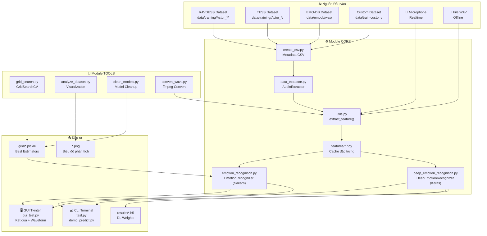

### 1.3. Luồng dữ liệu End-to-End

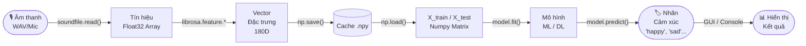

---

## 2. HƯỚNG DẪN CÀI ĐẶT MÔI TRƯỜNG

### 2.1. Yêu cầu hệ thống

| Thành phần | Phiên bản tối thiểu | Ghi chú |
|-----------|:------------------:|---------|
| **Python** | 3.9+ | Khuyến nghị 3.10/3.11 |
| **RAM** | 8 GB | 16 GB để train DL thoải mái |
| **GPU** | Không bắt buộc | CUDA/cuDNN tăng tốc DL |
| **ffmpeg** | Mới nhất | Bắt buộc nếu dùng `convert_wavs.py` |
| **Microphone** | Bất kỳ | Cần cho `test.py` và `gui_test.py` |

### 2.2. Cài đặt từng bước

**Bước 1 — Clone repository:**
```bash
git clone https://github.com/Hisu04/emotion-recognition-using-speech-master.git
cd emotion-recognition-using-speech-master
```

**Bước 2 — Cài đặt dependencies:**
```bash
pip install -r requirements.txt
```

**Nội dung `requirements.txt`:**

| Thư viện | Phiên bản | Mục đích |
|----------|:---------:|---------|
| `librosa` | ≥ 0.11.0 | Phân tích và trích xuất đặc trưng âm thanh |
| `numpy` | ≥ 2.1.1 | Tính toán ma trận số học |
| `pandas` | ≥ 2.2.3 | Quản lý metadata CSV |
| `soundfile` | ≥ 0.13.1 | Đọc file WAV |
| `scikit-learn` | ≥ 1.5.2 | Mô hình ML cổ điển và đánh giá |
| `tensorflow` | ≥ 2.21.0 | Xây dựng và huấn luyện mạng DL |
| `tensorboard` | ≥ 2.20.0 | Theo dõi quá trình huấn luyện |
| `matplotlib` | ≥ 3.10.8 | Vẽ biểu đồ và waveform |
| `pyaudio` | ≥ 0.2.14 | Ghi âm từ microphone |
| `tqdm` | ≥ 4.66.5 | Thanh tiến trình |
| `wave` | built-in | Đọc/ghi file WAV |

**Bước 3 — Cài ffmpeg (Windows):**
```bash
# Tải ffmpeg từ https://ffmpeg.org/download.html
# Thêm vào PATH, kiểm tra:
ffmpeg -version
```

**Bước 4 — Dọn dẹp mô hình cũ (nếu upgrade sklearn):**
```bash
python tools/clean_models.py
```

---

## 3. BIỂU ĐỒ USE CASE VÀ ĐẶC TẢ

### 3.1. Biểu đồ Use Case tổng quan

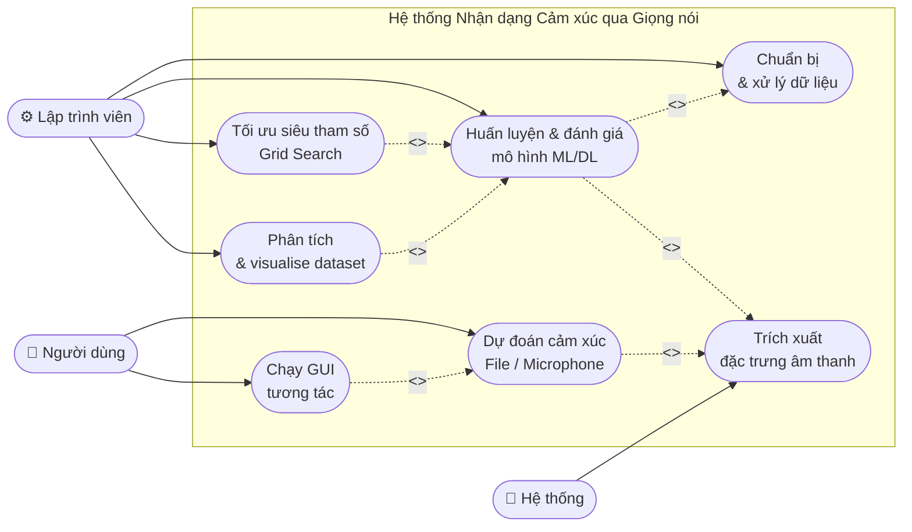

### 3.2. Bảng đặc tả Use Case

| Use Case | ID | Actor | Mô tả ngắn | Module |
|----------|:--:|-------|------------|--------|
| Chuẩn bị dữ liệu | UC01 | Hệ thống | Quét dataset, gán nhãn, tạo CSV | `core/create_csv.py` |
| Trích xuất đặc trưng | UC02 | Hệ thống | MFCC/Chroma/Mel → vector 180D | `core/utils.py` |
| Huấn luyện ML | UC03 | Lập trình viên | sklearn `model.fit(X_train, y_train)` | `core/emotion_recognition.py` |
| Huấn luyện DL | UC04 | Lập trình viên | Keras Sequential LSTM/GRU | `core/deep_emotion_recognition.py` |
| Dự đoán File | UC05 | Người dùng | `predict(wav_path)` → nhãn | `demo_predict.py` |
| Dự đoán Mic | UC06 | Người dùng | PyAudio record → predict | `gui_test.py`, `test.py` |
| Grid Search | UC07 | Lập trình viên | `GridSearchCV(cv=3, n_jobs=4)` | `tools/grid_search.py` |
| Phân tích Dataset | UC08 | Lập trình viên | Biểu đồ phân bổ + Confusion Matrix | `tools/analyze_dataset.py` |

---

## 4. HƯỚNG DẪN VẬN HÀNH (OPERATION GUIDE)

### 4.1. Cách 1: Chạy Giao diện Đồ hoạ (GUI) — Dành cho Người dùng cuối

```bash
python gui_test.py
```

**Giao diện hiển thị:**
- Panel trái: Nút ghi âm, nhãn kết quả, thông tin mô hình
- Panel phải: Biểu đồ waveform cập nhật sau mỗi lần ghi

**Luồng vận hành GUI:**

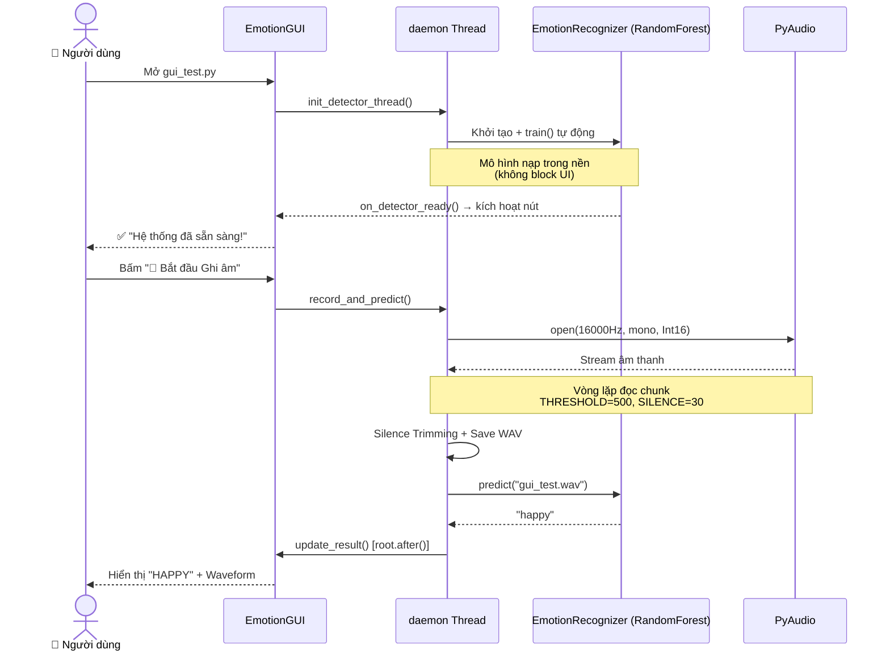

**Hằng số cấu hình trong `gui_test.py`:**

| Hằng số | Giá trị | Mô tả |
|---------|:-------:|-------|
| `THRESHOLD` | 500 | Ngưỡng biên độ phân biệt tiếng nói / im lặng |
| `CHUNK_SIZE` | 1024 | Số mẫu âm thanh đọc mỗi lần |
| `FORMAT` | `paInt16` | Định dạng âm thanh 16-bit |
| `RATE` | 16000 | Tần số lấy mẫu (Hz) |
| `SILENCE` | 30 | Số frames im lặng liên tiếp để dừng ghi |

---

### 4.2. Cách 2: Ghi âm Realtime qua CLI

```bash
python test.py
```

**Với các tham số tuỳ chỉnh:**
```bash
# Chọn cảm xúc tuỳ ý
python test.py --emotions "sad,neutral,happy,angry,fear"

# Chọn mô hình cụ thể
python test.py --model "MLPClassifier"

# Kết hợp
python test.py -e "sad,neutral,happy" -m "RandomForestClassifier"
```

**Các mô hình khả dụng (CLI):** `SVC`, `RandomForestClassifier`, `GradientBoostingClassifier`, `KNeighborsClassifier`, `MLPClassifier`, `BaggingClassifier`

**Luồng xử lý `test.py`:**

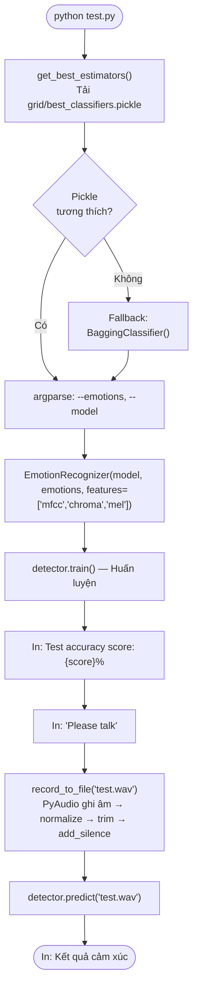

---

### 4.3. Cách 3: Demo Dự đoán từ File WAV (Không cần Mic)

```bash
python demo_predict.py
```

**Dùng khi:** Không có microphone hoặc muốn kiểm tra nhanh hệ thống.

**Luồng xử lý:**
1. Chọn ngẫu nhiên 1 file WAV từ `data/emodb/wav/`
2. Khởi tạo `MLPClassifier` mới (tránh lỗi pickle không tương thích)
3. Tự động train và in accuracy
4. Dự đoán cảm xúc của file WAV đó

---

### 4.4. Cách 4: Sử dụng API Python Trực tiếp

#### Ví dụ 1 — Phân loại với sklearn (3 cảm xúc):
```python
from core.emotion_recognition import EmotionRecognizer
from sklearn.svm import SVC

model = SVC()
rec = EmotionRecognizer(model=model, emotions=['sad', 'neutral', 'happy'],
                        balance=True, verbose=0)
rec.train()
print("Test score:", rec.test_score())
print("Prediction:", rec.predict("data/emodb/wav/15a04Nc.wav"))
```

#### Ví dụ 2 — Deep Learning với LSTM (5 cảm xúc):
```python
from core.deep_emotion_recognition import DeepEmotionRecognizer

deeprec = DeepEmotionRecognizer(
    emotions=['angry', 'sad', 'neutral', 'ps', 'happy'],
    n_rnn_layers=2, n_dense_layers=2,
    rnn_units=128, dense_units=128
)
deeprec.train()
print("Accuracy:", deeprec.test_score())
print("Prediction:", deeprec.predict("test.wav"))
# Xác suất từng lớp
print("Probabilities:", deeprec.predict_proba("test.wav"))
```

#### Ví dụ 3 — Tự động chọn mô hình tốt nhất:
```python
from core.emotion_recognition import EmotionRecognizer

# Không truyền model → tự động determine_best_model()
rec = EmotionRecognizer(emotions=["angry", "neutral", "sad"],
                        balance=False, verbose=1, custom_db=False)
print(rec.confusion_matrix())
```

---

## 5. LUỒNG XỬ LÝ CHI TIẾT TỪNG GIAI ĐOẠN

### 5.1. Giai đoạn 1: Chuẩn bị Dữ liệu (`create_csv.py`)

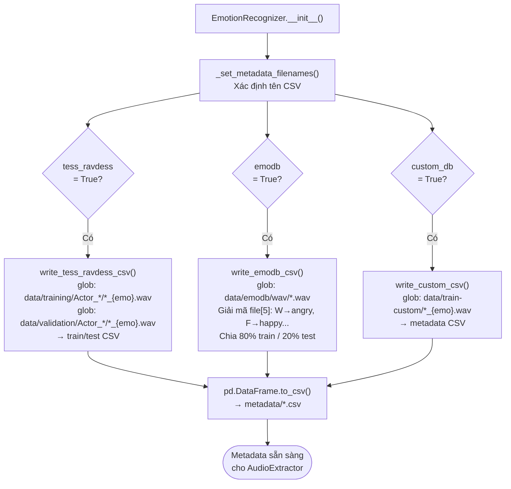

**Bảng mã hoá cảm xúc EMO-DB (ký tự thứ 5 trong tên file):**

| Ký tự | Cảm xúc | Ký tự | Cảm xúc |
|:-----:|---------|:-----:|---------|
| `W` | angry | `F` | happy |
| `L` | boredom | `T` | sad |
| `E` | disgust | `N` | neutral |
| `A` | fear | | |

---

### 5.2. Giai đoạn 2: Trích xuất Đặc trưng (`utils.py` + `data_extractor.py`)

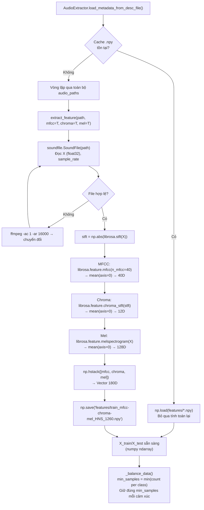

**Quy tắc đặt tên file cache:**
```
features/{partition}_{features}_{emotions}_{n_samples}.npy

Ví dụ:
features/train_mfcc-chroma-mel_HNS_1260.npy
               ↑           ↑    ↑     ↑
           partition  features  emotions  n_samples
                      (joined)  (sorted first letters)
```

---

### 5.3. Giai đoạn 3: Huấn luyện Mô hình

**A. Machine Learning (sklearn):**

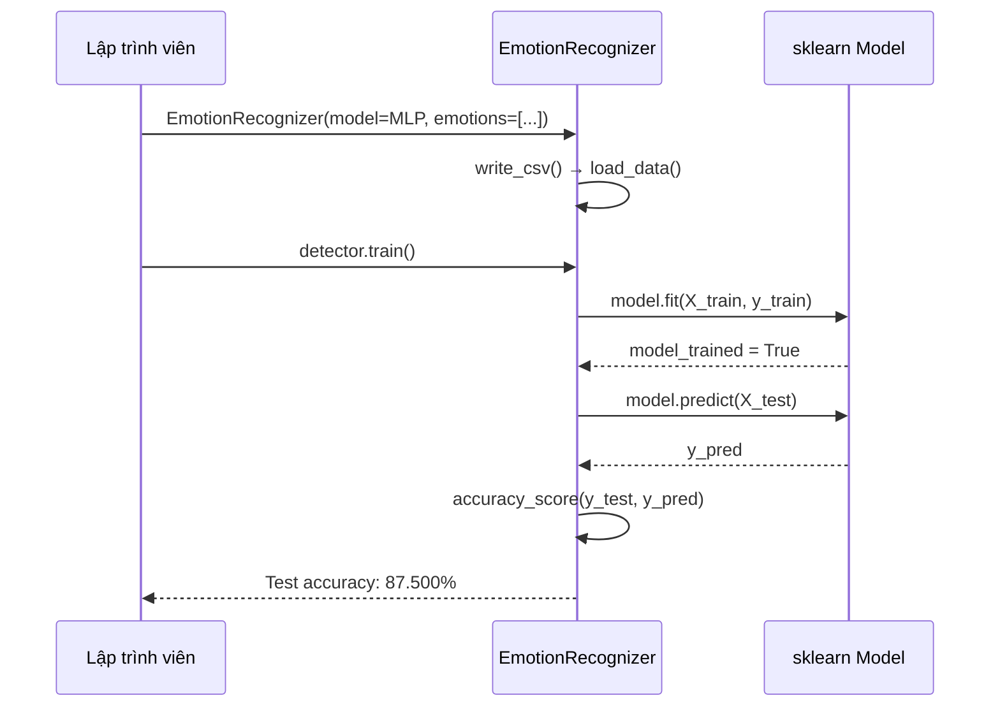

**B. Deep Learning (Keras):**

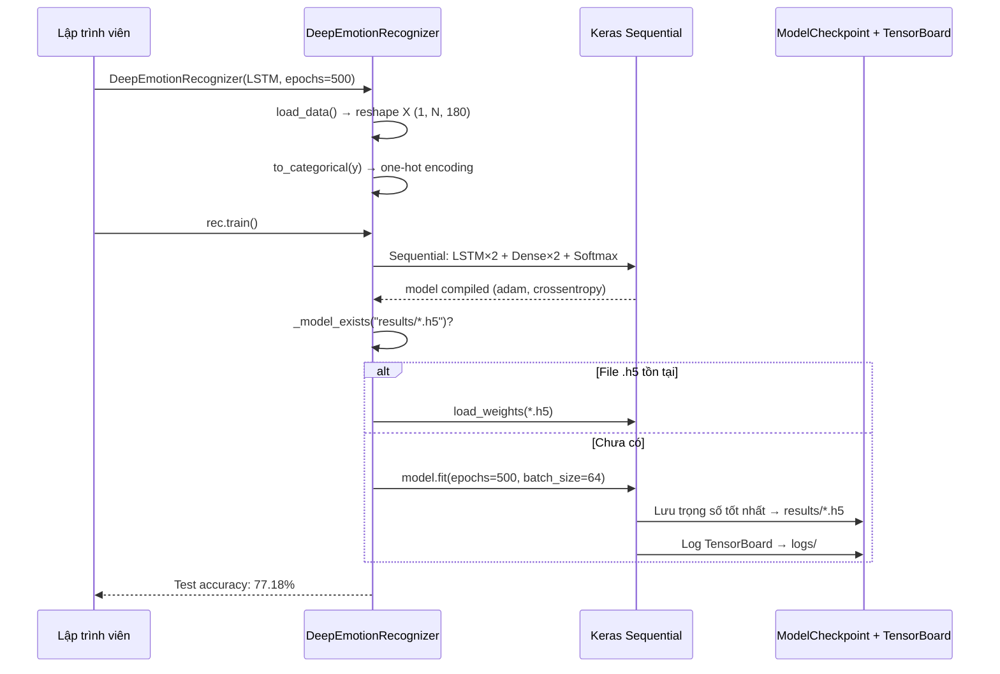

---

### 5.4. Giai đoạn 4: Đánh giá Mô hình

| Chỉ số | Method | Áp dụng khi |
|--------|--------|------------|
| **Train Accuracy** | `detector.train_score()` | `classification=True` |
| **Test Accuracy** | `detector.test_score()` | `classification=True` |
| **F-beta Score** | `detector.test_fbeta_score(beta=0.5)` | Tất cả |
| **MSE** | `detector.test_score()` | `classification=False` |
| **Confusion Matrix** | `detector.confusion_matrix(percentage=True)` | `classification=True` |
| **So sánh giữa các model** | `plot_histograms()` | Sau Grid Search |

**Ví dụ confusion matrix có nhãn:**
```
              predicted_angry  predicted_sad  predicted_neutral
true_angry          80.77%          7.69%           3.85%
true_sad            12.82%         73.08%           3.85%
true_neutral         1.28%          1.28%          79.49%
```

---

### 5.5. Giai đoạn 5: Dự đoán Realtime

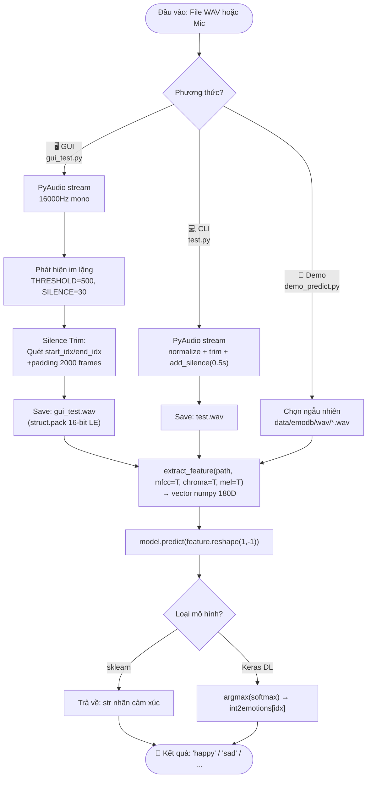

---

## 6. HƯỚNG DẪN TỐI ƯU HOÁ (GRID SEARCH)

> [!important] Thực hiện Grid Search để có mô hình tốt nhất
> Grid Search đã có kết quả sẵn trong `grid/` — chỉ cần chạy lại khi nâng cấp sklearn hoặc muốn thay đổi tham số.

### 6.1. Quy trình Grid Search

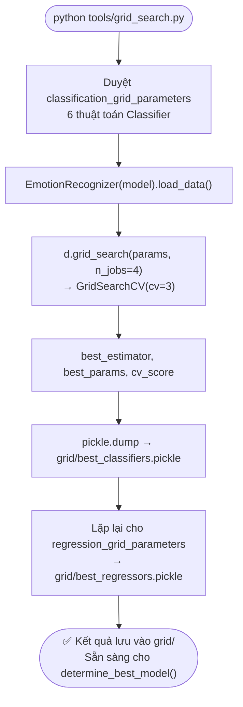

### 6.2. Kết quả Grid Search đã tìm được

| Thuật toán | Tham số tốt nhất | Ghi chú |
|-----------|------------------|---------|
| **SVC** | `C=0.001, gamma=0.001, kernel='poly'` | — |
| **RandomForest** | `max_depth=7, max_features=0.5, n_estimators=40` | — |
| **GradientBoosting** | `lr=0.3, max_depth=7, n_estimators=70, subsample=0.7` | — |
| **KNeighbors** | `n_neighbors=5, p=1, weights='distance'` | — |
| **MLPClassifier** | `alpha=0.005, hidden=(300,), batch=256, max_iter=500` | ⭐ Tốt nhất |
| **BaggingClassifier** | `n_estimators=50, max_samples=0.8` | Mặc định |

---

## 7. HƯỚNG DẪN THÊM DỮ LIỆU TUỲ CHỈNH

### 7.1. Chuẩn bị file âm thanh Custom

**Quy tắc đặt tên file:**
```
{bất_kỳ}_{emotion}.wav

Ví dụ:
recording_001_happy.wav     → nhãn: happy
20240101_120000_sad.wav     → nhãn: sad
my_voice_angry.wav          → nhãn: angry
```

**Cảm xúc hợp lệ:** `neutral`, `calm`, `happy`, `sad`, `angry`, `fear`, `disgust`, `ps`, `boredom`

### 7.2. Chuẩn hoá file âm thanh

```bash
# Chuyển đổi file đơn lẻ
python tools/convert_wavs.py input.mp3 output.wav

# Chuyển đổi cả thư mục
python tools/convert_wavs.py data/raw/ data/converted/

# Xoá file gốc sau khi convert
python tools/convert_wavs.py data/raw/ data/converted/ -r True
```

### 7.3. Đặt file vào đúng thư mục

```
data/train-custom/   ← File để huấn luyện
data/test-custom/    ← File để kiểm thử
```

### 7.4. Bật custom dataset khi khởi tạo

```python
rec = EmotionRecognizer(
    model=MLP(),
    emotions=['sad', 'neutral', 'happy'],
    custom_db=True,   # Bật custom dataset
    tess_ravdess=True,
    emodb=True
)
```

---

## 8. CÁC TÌNH HUỐNG LỖI PHỔ BIẾN VÀ CÁCH XỬ LÝ

### 8.1. Bảng xử lý lỗi

| Lỗi | Nguyên nhân | Cách xử lý |
|-----|-------------|-----------|
| `ModuleNotFoundError: sklearn` | Pickle cũ không tương thích phiên bản sklearn | Chạy `python tools/clean_models.py` → `python tools/grid_search.py` |
| `NotImplementedError: ffmpeg` | ffmpeg chưa được cài hoặc chưa trong PATH | Cài ffmpeg và thêm vào PATH |
| `OSError: [Errno -9996]` | PyAudio không tìm thấy thiết bị âm thanh | Kiểm tra driver âm thanh, cắm mic |
| `EmptyDataError` từ pandas | Thư mục dataset trống hoặc sai đường dẫn | Kiểm tra cấu trúc `data/` |
| GUI đóng băng khi khởi động | Mô hình đang train trên main thread | Đảm bảo `init_detector_thread()` dùng daemon thread |
| Accuracy quá thấp (<50%) | Dataset mất cân bằng nghiêm trọng | Bật `balance=True` trong `EmotionRecognizer` |
| Cache `.npy` lỗi kích thước | Thay đổi `audio_config` nhưng cache cũ vẫn còn | Xóa toàn bộ `features/*.npy` |

### 8.2. Quy trình khởi động lại sạch

```bash
# 1. Dọn mô hình cũ
python tools/clean_models.py

# 2. Xoá cache đặc trưng cũ (nếu cần)
del features\*.npy   # Windows
rm features/*.npy    # Linux/Mac

# 3. Chạy Grid Search lại (lâu — hàng giờ)
python tools/grid_search.py

# 4. Phân tích dataset
python tools/analyze_dataset.py

# 5. Chạy GUI
python gui_test.py
```

---

## 9. CÁC SỐ LIỆU HIỆU NĂNG THAM KHẢO

### 9.1. Kết quả đo lường thực tế

| Kịch bản | Mô hình | Cảm xúc | Test Accuracy | Ghi chú |
|----------|---------|---------|:-------------:|---------|
| 3 cảm xúc (SVC) | SVC | sad, neutral, happy | ~81.5% | README Example 1 |
| 3 cảm xúc (MLP best) | MLPClassifier | sad, neutral, happy | ~89.6% | `determine_best_model()` |
| 3 cảm xúc (RandomForest) | RandomForestClassifier | angry, neutral, sad | ~93.5% | README Example 3 |
| 5 cảm xúc (LSTM) | DeepEmotionRecognizer | angry, sad, neutral, ps, happy | ~77.2% | README Example 2 |
| Demo script (MLP) | MLPClassifier | sad, neutral, happy, angry | ~87.5% | `demo_predict.py` |

### 9.2. Thời gian thực thi ước tính

| Tác vụ | Thời gian ước tính |
|--------|:------------------:|
| Trích xuất đặc trưng lần đầu | 5–15 phút |
| Tải từ cache `.npy` lần sau | < 5 giây |
| Train MLPClassifier | 1–5 phút |
| Train DeepEmotionRecognizer (500 epochs) | 10–60 phút |
| Grid Search toàn bộ | 2–8 giờ |
| Dự đoán một file WAV | < 3 giây |
| Khởi động GUI (nạp mô hình) | 30–60 giây |

---

## 10. CẤU TRÚC TÀI LIỆU DỰ ÁN

| File tài liệu | Nội dung |
|--------------|---------|
| `README.md` | Giới thiệu, hướng dẫn cài đặt, ví dụ sử dụng nhanh (tiếng Anh) |
| `MODULE_CORE.md` | Đặc tả kỹ thuật chi tiết toàn bộ module `core/` |
| `MODULE_TOOLS.md` | Đặc tả kỹ thuật toàn bộ module `tools/` |
| `MODULE_USECASE.md` | Đặc tả Use Case 4 chức năng chính theo chuẩn học thuật |
| **`PROJECT_GUIDE.md`** | **Tài liệu này** — Hướng dẫn vận hành tổng quan |
| `CITATION.cff` | Thông tin trích dẫn học thuật |
| `LICENSE` | Giấy phép MIT |

---

## 11. THÔNG TIN TRÍCH DẪN (CITATION)

```bibtex
@software{speech_emotion_recognition_2019,
  author       = {Abdeladim Fadheli},
  title        = {Speech Emotion Recognition},
  version      = {1.0.0},
  year         = {2019},
  publisher    = {GitHub},
  url          = {https://github.com/x4nth055/emotion-recognition-using-speech}
}
```

**Phiên bản được fork và cải tiến bởi:** Hisu04
- Thêm GUI Tkinter với Waveform Plot
- Cải thiện tiền xử lý âm thanh (Silence Trimming tự động)
- Tái cấu trúc dự án theo module (`core/`, `tools/`, `metadata/`)
- Bổ sung tài liệu học thuật đầy đủ
