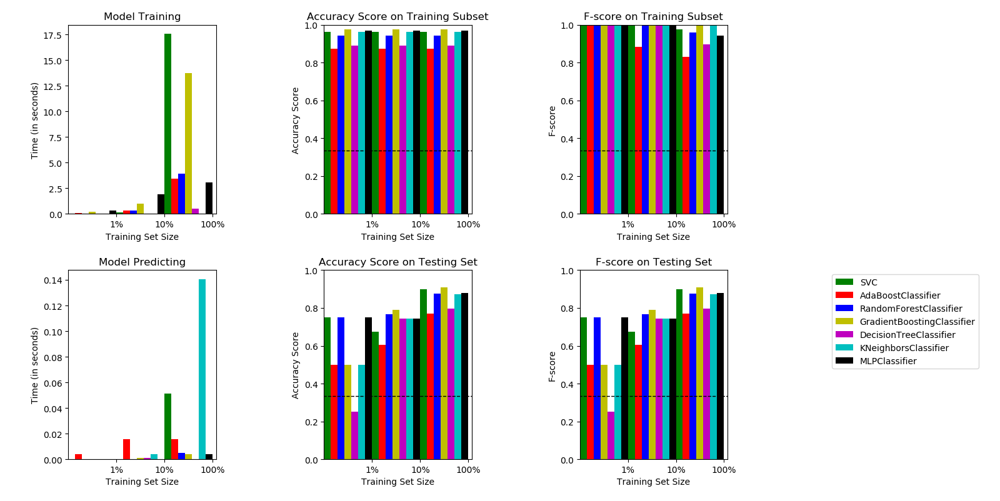

# Nhận dạng Cảm xúc qua Giọng nói

> Hệ thống machine learning nhận dạng cảm xúc của con người qua tín hiệu âm thanh, hỗ trợ cả hai phương pháp ML cổ điển (scikit-learn) và học sâu (Keras/TensorFlow).

[](https://www.python.org/)
[](https://www.tensorflow.org/)
[](https://scikit-learn.org/)
[](LICENSE)

---

## Mục lục

1. [Giới thiệu](#giới-thiệu)
2. [Cấu trúc dự án](#cấu-trúc-dự-án)
3. [Yêu cầu hệ thống](#yêu-cầu-hệ-thống)
4. [Cài đặt](#cài-đặt)
5. [Bộ dữ liệu](#bộ-dữ-liệu)
6. [Trích xuất đặc trưng](#trích-xuất-đặc-trưng)
7. [Hướng dẫn sử dụng](#hướng-dẫn-sử-dụng)
   - [Giao diện GUI](#1-giao-diện-gui-khuyến-nghị)
   - [Ghi âm Realtime qua CLI](#2-ghi-âm-realtime-qua-cli)
   - [Demo dự đoán (không cần mic)](#3-demo-dự-đoán-không-cần-microphone)
   - [Python API](#4-python-api)
8. [Thuật toán](#thuật-toán)
9. [Grid Search & Tối ưu hoá](#grid-search--tối-ưu-hoá)
10. [Hiệu năng tham khảo](#hiệu-năng-tham-khảo)
11. [Xử lý sự cố](#xử-lý-sự-cố)
12. [Tài liệu dự án](#tài-liệu-dự-án)
13. [Trích dẫn](#trích-dẫn)

---

## Giới thiệu

**Nhận dạng Cảm xúc qua Giọng nói** là hệ thống phát hiện cảm xúc của con người từ tín hiệu âm thanh. Hệ thống hỗ trợ tối đa **9 nhãn cảm xúc** và cung cấp hai phương pháp mô hình hoá:

- **ML cổ điển** — thông qua các bộ phân loại/hồi quy `scikit-learn` (SVC, MLP, RandomForest, v.v.)
- **Học sâu (Deep Learning)** — thông qua mô hình `Sequential` của Keras với các tầng LSTM/GRU

Hệ thống bao gồm **giao diện đồ hoạ Tkinter** đầy đủ tính năng, các script dòng lệnh, và Python API dạng module.

**Cảm xúc được hỗ trợ:** `neutral` (trung tính) · `calm` (bình tĩnh) · `happy` (vui) · `sad` (buồn) · `angry` (tức giận) · `fear` (sợ hãi) · `disgust` (ghê tởm) · `ps` (ngạc nhiên dễ chịu) · `boredom` (chán nản)

---

## Cấu trúc dự án

```
emotion-recognition-using-speech-master/
│
├── 📂 core/                         ← Logic AI cốt lõi
│   ├── __init__.py
│   ├── create_csv.py                ← Tạo metadata CSV từ các dataset
│   ├── data_extractor.py            ← Tải và cache đặc trưng (AudioExtractor)
│   ├── emotion_recognition.py       ← Mô hình ML cổ điển (EmotionRecognizer)
│   ├── deep_emotion_recognition.py  ← Mô hình Deep Learning (DeepEmotionRecognizer)
│   ├── parameters.py                ← Không gian tham số Grid Search
│   └── utils.py                     ← Tiện ích âm thanh & extract_feature()
│
├── 📂 tools/                        ← Công cụ hỗ trợ phát triển
│   ├── analyze_dataset.py           ← Phân tích & trực quan hoá dataset
│   ├── clean_models.py              ← Xoá các mô hình cache không tương thích
│   ├── convert_wavs.py              ← Chuẩn hoá file WAV qua ffmpeg
│   └── grid_search.py               ← Tối ưu siêu tham số (GridSearchCV)
│
├── 📂 data/                         ← Dữ liệu âm thanh
│   ├── training/Actor_*/            ← Tập huấn luyện RAVDESS + TESS
│   ├── validation/Actor_*/          ← Tập kiểm thử RAVDESS + TESS
│   ├── emodb/wav/                   ← Dataset EMO-DB
│   ├── train-custom/                ← Dữ liệu huấn luyện tuỳ chỉnh (tuỳ chọn)
│   └── test-custom/                 ← Dữ liệu kiểm thử tuỳ chỉnh (tuỳ chọn)
│
├── 📂 metadata/                     ← File CSV mô tả dataset (tự sinh)
├── 📂 features/                     ← Mảng đặc trưng đã cache (.npy)
├── 📂 grid/                         ← Bộ ước lượng tốt nhất từ GridSearchCV (.pickle)
├── 📂 results/                      ← Trọng số mô hình Deep Learning (.h5)
├── 📂 logs/                         ← Log huấn luyện TensorBoard
├── 📂 images/                       ← Biểu đồ và hình ảnh kết quả
│
├── gui_test.py                      ← 🖥️  Ứng dụng GUI chính (Tkinter)
├── test.py                          ← 🎤  Ghi âm realtime qua CLI
├── demo_predict.py                  ← 🔬  Demo dự đoán theo lô (không cần mic)
└── requirements.txt                 ← Danh sách thư viện Python
```

---

## Yêu cầu hệ thống

| Thành phần     | Phiên bản tối thiểu | Ghi chú                                           |
|----------------|:-------------------:|---------------------------------------------------|
| **Python**     | 3.9+                | Khuyến nghị 3.10 / 3.11                           |
| **RAM**        | 8 GB                | 16 GB khuyến nghị cho Deep Learning               |
| **GPU**        | Không bắt buộc      | CUDA/cuDNN tăng tốc huấn luyện DL                |
| **ffmpeg**     | Mới nhất            | Bắt buộc khi dùng `convert_wavs.py`              |
| **Microphone** | Bất kỳ              | Cần cho `test.py` và `gui_test.py`               |

### Gói thư viện Python

| Thư viện        | Phiên bản | Mục đích                                      |
|-----------------|:---------:|-----------------------------------------------|
| `librosa`       | ≥ 0.11.0  | Phân tích âm thanh & trích xuất đặc trưng     |
| `numpy`         | ≥ 2.1.1   | Tính toán số học ma trận                      |
| `pandas`        | ≥ 2.2.3   | Quản lý metadata CSV                          |
| `soundfile`     | ≥ 0.13.1  | Đọc file WAV                                  |
| `scikit-learn`  | ≥ 1.5.2   | Mô hình ML cổ điển & đánh giá                 |
| `tensorflow`    | ≥ 2.21.0  | Deep Learning (Keras)                         |
| `tensorboard`   | ≥ 2.20.0  | Theo dõi quá trình huấn luyện                 |
| `matplotlib`    | ≥ 3.10.8  | Vẽ biểu đồ, đồ thị & hiển thị waveform       |
| `pyaudio`       | ≥ 0.2.14  | Ghi âm từ microphone                          |
| `tqdm`          | ≥ 4.66.5  | Thanh tiến trình                              |

---

## Cài đặt

**Bước 1 — Clone repository:**
```bash
git clone https://github.com/Hisu04/emotion-recognition-using-speech-master.git
cd emotion-recognition-using-speech-master
```

**Bước 2 — Cài đặt các thư viện Python:**
```bash
pip install -r requirements.txt
```

**Bước 3 — Cài đặt ffmpeg** *(tuỳ chọn, cần cho việc chuyển đổi âm thanh)*:
- Tải tại [ffmpeg.org](https://ffmpeg.org/download.html) và thêm vào biến môi trường `PATH`.
- Kiểm tra: `ffmpeg -version`

**Bước 4 — Dọn dẹp mô hình cache cũ** *(khi nâng cấp scikit-learn)*:
```bash
python tools/clean_models.py
```

---

## Bộ dữ liệu

Dự án sử dụng 4 bộ dữ liệu đặt trong thư mục `data/`:

| Bộ dữ liệu | Mô tả | Số cảm xúc |
|------------|-------|:----------:|
| [**RAVDESS**](https://zenodo.org/record/1188976) | 24 diễn viên (12 nam/12 nữ), giọng Bắc Mỹ trung tính, hai câu phát âm tương đương | 8 |
| [**TESS**](https://tspace.library.utoronto.ca/handle/1807/24487) | 2 nữ diễn viên (26 & 64 tuổi), 200 từ mục tiêu | 7 |
| [**EMO-DB**](http://emodb.bilderbar.info/docu/) | Giọng nói cảm xúc tiếng Đức, thu âm tại phòng cách âm ĐH Kỹ thuật Berlin | 7 |
| **Custom** | Bản ghi do người dùng cung cấp trong `data/train-custom/` và `data/test-custom/` | Tuỳ ý |

### Thêm dữ liệu âm thanh tuỳ chỉnh

1. Đặt tên file theo quy ước: `{tiền_tố_bất_kỳ}_{cảm_xúc}.wav`  
   *(ví dụ: `recording_001_happy.wav`, `20240101_angry.wav`)*
2. Chuẩn hoá về 16000 Hz mono bằng `tools/convert_wavs.py` (yêu cầu ffmpeg):
   ```bash
   python tools/convert_wavs.py input.mp3 output.wav
   ```
3. Đặt file vào `data/train-custom/` (huấn luyện) hoặc `data/test-custom/` (kiểm thử).
4. Bật tuỳ chọn `custom_db=True` khi khởi tạo `EmotionRecognizer`.

---

## Trích xuất đặc trưng

Đặc trưng được trích xuất từ âm thanh thô bằng thư viện [librosa](https://github.com/librosa/librosa) và ghép nối thành **vector 180 chiều**:

| Đặc trưng       | Số chiều | Mô tả                                          |
|-----------------|:--------:|------------------------------------------------|
| MFCC            | 40D      | Hệ số cepstral tần số mel (nội dung giọng điệu) |
| Chroma          | 12D      | Chromagram (nội dung hoà âm / cao độ)          |
| Mel Spectrogram | 128D     | Năng lượng tần số theo thang mel               |

**Cơ chế cache:** Đặc trưng đã trích xuất được lưu dưới dạng file `.npy` trong thư mục `features/` để tránh tính toán lại ở các lần chạy sau.

---

## Hướng dẫn sử dụng

### 1. Giao diện GUI *(Khuyến nghị)*

```bash
python gui_test.py
```

Khởi động giao diện Tkinter với:
- **Panel trái**: Nút ghi âm, nhãn kết quả cảm xúc, trạng thái mô hình
- **Panel phải**: Trực quan hoá waveform cập nhật sau mỗi lần ghi

Mô hình được nạp trong luồng nền (daemon thread) — giao diện vẫn phản hồi trong quá trình khởi tạo.

---

### 2. Ghi âm Realtime qua CLI

```bash
python test.py
```

Chờ đến khi xuất hiện dấu nhắc `Please talk`, sau đó nói chuyện. Mô hình sẽ tự động dự đoán cảm xúc khi phát hiện im lặng.

**Các tuỳ chọn khả dụng:**
```bash
python test.py --help
```
```
usage: test.py [-h] [-e EMOTIONS] [-m MODEL]

optional arguments:
  -e, --emotions   Danh sách cảm xúc cần nhận dạng, phân cách bằng dấu phẩy.
                   Mặc định: "sad,neutral,happy"
  -m, --model      Bộ phân loại sử dụng. Mặc định: "BaggingClassifier"
                   Lựa chọn: SVC, RandomForestClassifier,
                   GradientBoostingClassifier, KNeighborsClassifier,
                   MLPClassifier, BaggingClassifier
```

**Ví dụ:**
```bash
python test.py --emotions "sad,neutral,happy,angry" --model "MLPClassifier"
```

---

### 3. Demo Dự đoán (Không cần Microphone)

```bash
python demo_predict.py
```

Chọn ngẫu nhiên một file WAV từ `data/emodb/wav/`, huấn luyện `MLPClassifier` và dự đoán cảm xúc của file đó. Hữu ích khi kiểm tra pipeline mà không cần microphone.

---

### 4. Python API

#### Ví dụ 1 — ML cổ điển với 3 cảm xúc:
```python
from core.emotion_recognition import EmotionRecognizer
from sklearn.svm import SVC

model = SVC()
rec = EmotionRecognizer(model=model, emotions=['sad', 'neutral', 'happy'],
                        balance=True, verbose=0)
rec.train()
print("Điểm test:", rec.test_score())     # ví dụ: 0.8148
print("Điểm train:", rec.train_score())   # ví dụ: 1.0
print("Dự đoán:", rec.predict("data/emodb/wav/15a04Nc.wav"))
```

#### Ví dụ 2 — Tự động chọn mô hình tốt nhất:
```python
from core.emotion_recognition import EmotionRecognizer

# Không truyền model → tự động gọi determine_best_model()
rec = EmotionRecognizer(emotions=["angry", "neutral", "sad"],
                        balance=False, verbose=1, custom_db=False)
rec.determine_best_model()
print(rec.model.__class__.__name__, "là mô hình tốt nhất")
print("Điểm test:", rec.test_score())     # ví dụ: MLPClassifier → 0.8958
print(rec.get_samples_by_class())
```

**Kết quả:**
```
          train  test  total
angry       910   174   1084
neutral     650   109    759
sad         862   160   1022
total      2422   443   2865
```

#### Ví dụ 3 — Deep Learning với LSTM (5 cảm xúc):
```python
from core.deep_emotion_recognition import DeepEmotionRecognizer

deeprec = DeepEmotionRecognizer(
    emotions=['angry', 'sad', 'neutral', 'ps', 'happy'],
    n_rnn_layers=2, n_dense_layers=2,
    rnn_units=128, dense_units=128
)
deeprec.train()
print("Độ chính xác:", deeprec.test_score())          # ví dụ: 0.7718
print("Dự đoán:", deeprec.predict("test.wav"))        # ví dụ: "angry"

# Dự đoán phân phối xác suất
print(deeprec.predict_proba("data/emodb/wav/16a01Wb.wav"))
# {'angry': 0.9988, 'sad': 0.0010, 'neutral': 0.0000, 'ps': 0.0002, 'happy': 0.0000}
```

#### Ví dụ 4 — Ma trận nhầm lẫn (Confusion Matrix):
```python
print(deeprec.confusion_matrix(percentage=True, labeled=True))
```
```
              predicted_angry  predicted_sad  predicted_neutral  predicted_ps  predicted_happy
true_angry          80.77           7.69               3.85          5.13             2.56
true_sad            12.82          73.08               3.85          6.41             3.85
true_neutral         1.28           1.28              79.49          1.28            16.67
true_ps             10.26           3.85               1.28         79.49             5.13
true_happy           5.13           8.97               7.69          8.97            69.23
```

---

## Thuật toán

### Bộ phân loại — Classifiers (sklearn)
- `SVC` · `RandomForestClassifier` · `GradientBoostingClassifier`  
- `KNeighborsClassifier` · `MLPClassifier` · `BaggingClassifier`

### Bộ hồi quy — Regressors (sklearn)
- `SVR` · `RandomForestRegressor` · `GradientBoostingRegressor`  
- `KNeighborsRegressor` · `MLPRegressor` · `BaggingRegressor`

### Học sâu — Deep Learning (Keras)
- Các tầng **LSTM / GRU** có thể cấu hình linh hoạt kết hợp tầng **Dense**
- Kiến trúc mặc định: `LSTM(128) × 2 → Dense(128) × 2 → Softmax`

---

## Grid Search & Tối ưu hoá

Kết quả Grid Search đã được tính sẵn trong thư mục `grid/`. Để chạy lại hoặc tinh chỉnh siêu tham số:

```bash
python tools/grid_search.py
```

> ⏱️ Quá trình này có thể mất **2–8 giờ** tuỳ theo phần cứng. Các bộ ước lượng tốt nhất được lưu vào `grid/best_classifiers.pickle` và `grid/best_regressors.pickle`.

**Tham số tốt nhất đã tìm được:**

| Thuật toán                  | Tham số tốt nhất                                         |
|-----------------------------|----------------------------------------------------------|
| SVC                         | `C=0.001, gamma=0.001, kernel='poly'`                   |
| RandomForestClassifier      | `max_depth=7, max_features=0.5, n_estimators=40`        |
| GradientBoostingClassifier  | `lr=0.3, max_depth=7, n_estimators=70`                  |
| KNeighborsClassifier        | `n_neighbors=5, p=1, weights='distance'`                |
| **MLPClassifier** ⭐         | `alpha=0.005, hidden=(300,), batch=256, max_iter=500`   |
| BaggingClassifier           | `n_estimators=50, max_samples=0.8`                      |

### Vẽ biểu đồ so sánh

```python
from core.emotion_recognition import plot_histograms
plot_histograms(classifiers=True)
```


<p align="center"><em>Biểu đồ so sánh các chỉ số của từng thuật toán theo kích thước dữ liệu và thời gian huấn luyện/dự đoán.</em></p>

---

## Hiệu năng tham khảo

| Kịch bản                        | Mô hình                | Cảm xúc                              | Độ chính xác test |
|---------------------------------|------------------------|--------------------------------------|:-----------------:|
| 3 cảm xúc (SVC)                 | SVC                    | sad, neutral, happy                  | ~81.5%            |
| 3 cảm xúc (mô hình tốt nhất)   | MLPClassifier          | sad, neutral, happy                  | ~89.6%            |
| 3 cảm xúc (RandomForest)        | RandomForestClassifier | angry, neutral, sad                  | ~93.5%            |
| 5 cảm xúc (LSTM)                | DeepEmotionRecognizer  | angry, sad, neutral, ps, happy       | ~77.2%            |
| Script demo                     | MLPClassifier          | sad, neutral, happy, angry           | ~87.5%            |

**Thời gian chạy ước tính:**

| Tác vụ                                     | Thời gian ước tính |
|--------------------------------------------|:-----------------:|
| Trích xuất đặc trưng (lần đầu)             | 5–15 phút         |
| Tải từ cache (.npy)                        | < 5 giây          |
| Huấn luyện MLPClassifier                  | 1–5 phút          |
| Huấn luyện DeepEmotionRecognizer (500 epochs) | 10–60 phút    |
| Chạy toàn bộ Grid Search                  | 2–8 giờ           |
| Dự đoán một file WAV                      | < 3 giây          |
| Khởi động GUI (nạp mô hình)               | 30–60 giây        |

---

## Xử lý sự cố

| Lỗi | Nguyên nhân | Cách xử lý |
|-----|-------------|------------|
| `ModuleNotFoundError: sklearn` | Pickle không tương thích với phiên bản sklearn hiện tại | `python tools/clean_models.py` → `python tools/grid_search.py` |
| `NotImplementedError: ffmpeg` | ffmpeg chưa cài hoặc chưa có trong PATH | Cài ffmpeg và thêm vào biến môi trường PATH |
| `OSError: [Errno -9996]` | PyAudio không tìm thấy thiết bị âm thanh | Kiểm tra driver âm thanh và kết nối microphone |
| `EmptyDataError` (pandas) | Thư mục dataset trống hoặc sai đường dẫn | Kiểm tra lại cấu trúc thư mục `data/` |
| GUI bị đóng băng khi khởi động | Quá trình train mô hình chặn main thread | Đảm bảo `init_detector_thread()` sử dụng daemon thread |
| Độ chính xác < 50% | Dataset mất cân bằng nghiêm trọng | Bật `balance=True` trong `EmotionRecognizer` |
| Dự đoán sai sau khi thay cấu hình | Thay đổi `audio_config` nhưng cache `.npy` cũ vẫn còn | Xoá `features/*.npy` và chạy lại |

**Quy trình khởi động lại sạch:**
```bash
python tools/clean_models.py          # Xoá các file mô hình không tương thích
del features\*.npy                    # Windows: xoá cache đặc trưng
python tools/grid_search.py           # Chạy lại Grid Search (tuỳ chọn)
python gui_test.py                    # Khởi động ứng dụng
```

---

## Tài liệu dự án

| File | Nội dung |
|------|----------|
| `README.md` | File này — tổng quan, hướng dẫn cài đặt, ví dụ sử dụng |
| `PROJECT_GUIDE.md` | Hướng dẫn vận hành đầy đủ với sơ đồ kiến trúc, sequence diagram và luồng dữ liệu |
| `MODULE_CORE.md` | Đặc tả kỹ thuật chi tiết cho module `core/` |
| `MODULE_USECASE.md` | Đặc tả Use Case theo chuẩn học thuật cho 4 luồng chức năng chính |
| `MODULE_AUTH.md` | Tài liệu xác thực và phân quyền truy cập module |
| `CITATION.cff` | Metadata trích dẫn học thuật |

---

## Trích dẫn

Nếu bạn sử dụng dự án này trong nghiên cứu, vui lòng trích dẫn:

```bibtex
@software{speech_emotion_recognition_2019,
  author       = {Abdeladim Fadheli},
  title        = {Speech Emotion Recognition},
  version      = {1.0.0},
  year         = {2019},
  publisher    = {GitHub},
  url          = {https://github.com/x4nth055/emotion-recognition-using-speech}
}
```

**Fork và mở rộng bởi [Hisu04](https://github.com/Hisu04):**
- Giao diện Tkinter hiện đại với trực quan hoá waveform
- Tiền xử lý cắt im lặng tự động (Silence Trimming)
- Tái cấu trúc dự án theo module (`core/`, `tools/`, `metadata/`)
- Bổ sung tài liệu học thuật đầy đủ

---

*Tutorial gốc: [The Python Code — Speech Emotion Recognizer](https://www.thepythoncode.com/article/building-a-speech-emotion-recognizer-using-sklearn)*
