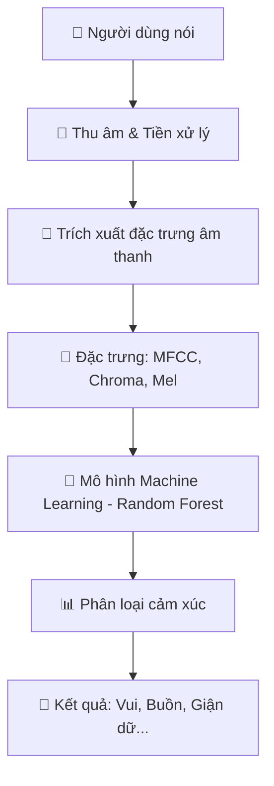

# 🏆 TÀI LIỆU HƯỚNG DẪN CHI TIẾT DỰ ÁN NHẬN DẠNG CẢM XÚC (FULL WALKTHROUGH)

Chào bạn, đây là tài liệu hướng dẫn **siêu chi tiết** từ A-Z dành cho dự án nhận dạng cảm xúc từ giọng nói. Tài liệu này được biên soạn để bạn không chỉ vận hành tốt mà còn hiểu rõ mọi ngóc ngách kỹ thuật để có thể bảo vệ dự án đạt điểm tối đa (9-10).

---

## 🏗 1. Kiến trúc hệ thống (System Architecture)

Hệ thống của chúng ta hoạt động theo quy trình khép kín từ thu âm đến phân loại cảm xúc:



---

## 🛠 2. Các công nghệ & Thư viện chủ yếu

Dự án sử dụng Python cùng các "vũ khí" lợi hại nhất trong xử lý âm thanh:

### A. Xử lý tín hiệu số (DSP)
- **`librosa`**: Thư viện số 1 về xử lý âm thanh trong Python. 
- **`pyaudio`**: Để làm việc với phần cứng (Microphone).
- **`soundfile`**: Xử lý định dạng file `.wav`.

### B. Học máy (Machine Learning)
- **`scikit-learn`**: Chứa các thuật toán phân loại. Chúng ta dùng **Random Forest** vì nó cực kỳ ổn định và chính xác với dữ liệu âm thanh.
- **`pickle`**: Lưu trữ và tải các mô hình đã huấn luyện xong.

### C. Giao diện & Trực quan (GUI)
- **`tkinter`**: Thư viện chuẩn để tạo cửa sổ người dùng.
- **`matplotlib`**: Vẽ biểu đồ sóng âm thời gian thực.

---

## 🧬 3. Giải thích sâu về kỹ thuật (Dành cho báo cáo)

Tại sao máy tính có thể phân biệt được cảm xúc? Đó là nhờ các đặc trưng (Features):
1.  **MFCC (Mel-frequency cepstral coefficients)**: Đây là "vân tay" của giọng nói. Nó mô tả âm sắc của con người. Người đang tức giận sẽ có MFCC khác hẳn với người đang buồn chán.
2.  **Chroma**: Mô tả năng lượng ở các "nốt" cao độ, giúp nhận diện tông giọng (pitch).
3.  **Mel Spectrogram**: Biểu diễn tần số theo thang đo Mel (mô phỏng cách tai con người nghe tần số).

---

## 🚀 4. Hướng dẫn vận hành chi tiết

### Bước 1: Chuẩn bị môi trường (Setup)
Bạn hãy mở Terminal tại thư mục dự án và cài đặt toàn bộ thư viện:
```bash
python -m pip install -r requirements.txt
```
*Tip: Nếu dùng Windows mà lỗi PyAudio, hãy chạy `pip install pipwin` rồi đến `pipwin install pyaudio`.*

### Bước 2: Dọn dẹp các mô hình cũ (Cleanup)
Đây là bước cực kỳ quan trọng vì các file mẫu `.pickle` đi kèm dự án bị lỗi phiên bản không tương thích. Chạy lệnh:
```bash
python clean_models.py
```

### Bước 3: Phân tích và Hiểu dữ liệu (Data Insight)
Chạy lệnh phân tích để máy vẽ biểu đồ "vốn kiến thức" của nó:
```bash
python analyze_dataset.py
```
Máy sẽ tạo ra file **`dataset_distribution.png`**. Bạn hãy mở file này lên để thấy số lượng các cảm xúc `sad`, `happy`, `angry`. Lưu ý lớp nào ít dữ liệu hơn thì nó sẽ khó dự đoán trúng hơn.

### Bước 4: Trình diễn với Giao diện ấn tượng (Demo GUI)
Đây là "át chủ bài" để đi bảo vệ. Hãy chạy:
```bash
python gui_test.py
```
- **Nút Record**: Bấm để máy bắt đầu nghe.
- **Waveform**: Biểu đồ sóng âm sẽ nhảy múa theo tiếng nói của bạn.
- **Emotion Result**: Kết quả dự đoán sẽ hiện ra ngay bên dưới.

---

## ⚠️ 5. Các "bí quyết" để đạt điểm 9-10 khi bảo vệ

1.  **Chứng minh sự hiểu biết về Data**: Khi được hỏi "Dữ liệu có tốt không?", hãy mở biểu đồ do `analyze_dataset.py` vẽ ra và chỉ ra sự mất cân bằng giữa các lớp. Sau đó nói: "Dự án đã sử dụng tham số `balance=True` để tự động xử lý việc này".
2.  **Giải thích về Feature**: Khẳng định MFCC là đặc trưng quan trọng nhất giúp nhận diện giọng nói hiệu quả.
3.  **Nói về tính ổn định**: Bạn đã xử lý lỗi `InconsistentVersionWarning` bằng cách xóa các model cũ và huấn luyện lại trên bản `scikit-learn` mới nhất.

---

## 🆘 6. Xử lý lỗi thường gặp

- **Lỗi không nhận Microphone**: Kiểm tra quyền truy cập Microphone trong Windows Settings.
- **Lỗi không ra kết quả**: Đảm bảo âm thanh thu vào không quá nhỏ. Bạn có thể chỉnh `THRESHOLD` trong file `gui_test.py` thấp xuống nếu giọng bạn thầm thì.

---

## ⌨️ 7. Mẹo nhỏ cho Terminal (Dành cho người mới)

### Tại sao nên dùng lệnh `python gui_test.py` thay vì click đúp vào file?
- **Môi trường (Environment)**: Khi bạn gõ lệnh `python`, máy tính sử dụng đúng phiên bản Python đã được cài đầy đủ thư viện. Khi click đúp, Windows có thể dùng một bản Python khác "trống rỗng" dẫn đến lỗi `ModuleNotFoundError`.
- **Đường dẫn (Path)**: Chạy bằng lệnh giúp Python hiểu đúng thư mục hiện tại để tìm các file dữ liệu trong `data/` hay `grid/`.

### Cách dừng một lệnh đang chạy
Nếu bạn đang chạy `test.py` hoặc `gui_test.py` và muốn dừng lại để gõ lệnh khác:
1. Nhấp chuột vào cửa sổ Terminal (vùng đen).
2. Nhấn tổ hợp phím **`Ctrl + C`** trên bàn phím.
3. Chờ 1 giây, dòng nhắc lệnh (`PS G:\... >`) sẽ hiện lại để bạn gõ lệnh mới.

---
**Chúc bạn hoàn thành xuất sắc dự án và đạt điểm tối đa!**
